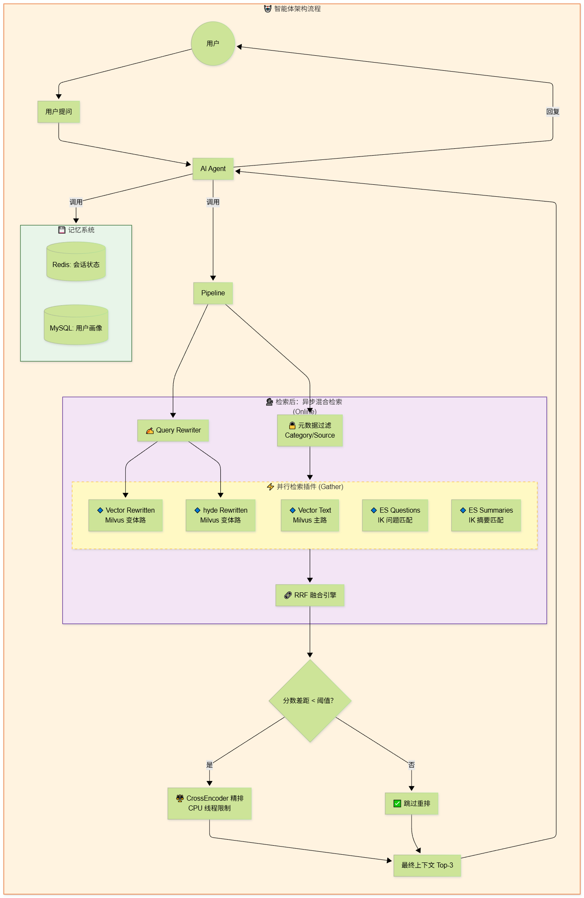
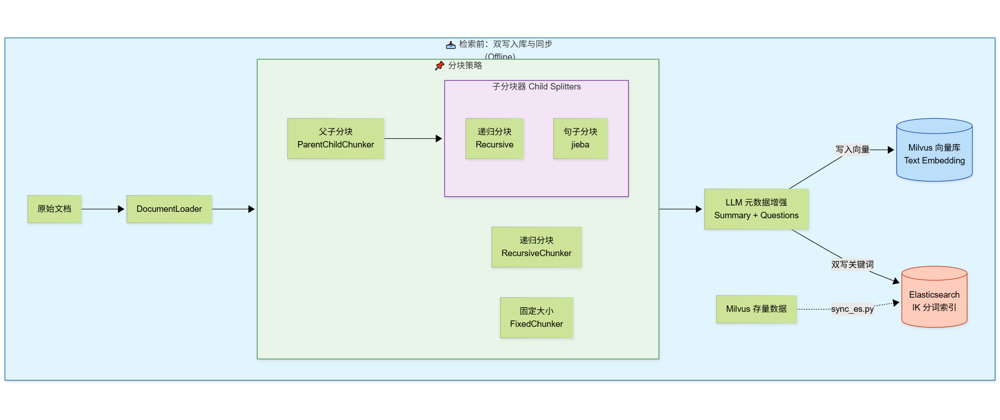

# 🧠 Modular RAG Agent: 企业级混合检索智能体平台

> **基于 LangGraph、Milvus 和 Elasticsearch 构建的高性能、可插拔、异步并发的模块化 RAG 系统。**
>
> 本项目实现了从**离线双写入库**到**在线四路并行召回**的全链路高级 RAG 架构，支持动态重排、元数据过滤及自动化评估，旨在解决传统 RAG 在精确匹配、多跳推理及长尾问题上的痛点。

---

## 🌟 核心特性 (Key Features)

### 🚀 高性能混合检索 (Hybrid Search)
*   **双引擎驱动**：结合 **Milvus** (向量语义检索) 与 **Elasticsearch** (IK 分词关键词检索)，兼顾语义理解与专有名词精确匹配。
*   **四路并行召回**：
    1.  **Vector Text**: 原文语义匹配。
    2.  **Vector Rewritten**: LLM 重写查询后的语义匹配。
    3.  **ES Questions**: 假设性问题 (Hypothetical Questions) 精确匹配。
    4.  **ES Summaries**: 核心摘要 (Summary) 精确匹配。
*   **异步并发执行**：基于 `asyncio.gather` 实现多路检索并行执行，显著降低端到端延迟。

### 🧩 模块化与可插拔 (Modular & Pluggable)
*   **策略模式设计**：所有检索器 (`Retriever`)、过滤器 (`Filter`)、融合器 (`Fusion`) 均为独立插件。
*   **配置驱动**：通过 `.env` 即可动态开关混合检索、重排策略、ES 插件等，无需修改代码。
*   **RRF 融合引擎**：采用倒数排名融合 (Reciprocal Rank Fusion) 算法，自动平衡多路结果，无需复杂调参。

### ⚡ 智能优化策略 (Smart Optimization)
*   **动态重排 (Dynamic Reranking)**：基于分数差距阈值智能决策是否触发 CrossEncoder 重排，在精度与算力成本间取得最佳平衡。
*   **元数据过滤**：支持按类别、来源等标量字段进行预过滤，提升检索针对性。
*   **存量同步工具**：内置 `sync_es.py`，可将 Milvus 历史数据一键同步至 ES，无需重新计算 Embedding 或调用 LLM。

### 📊 自动化评估 (Automated Evaluation)
*   内置多维度测试脚本 (`recall_evaluation.py`)，自动计算 **Hit Rate@K** 和 **MRR (平均倒数排名)**。
*   覆盖精确匹配、语义推理、多跳推理、防混淆四大测试场景。

---

## 🏗️ 系统架构 (Architecture)

### 数据流向图



### 技术栈
*   **编排框架**: LangGraph, LangChain
*   **向量数据库**: Milvus (Zilliz)
*   **搜索引擎**: Elasticsearch (IK Analyzer)
*   **大模型**: Qwen-3-4B (via vLLM/OpenAI Compatible)
*   **Embedding**: BGE-Large-ZH / BGE-Small-ZH
*   **重排模型**: BGE-Reranker-Base
*   **运行时**: Python 3.10+, Asyncio
*   **容器化**: Docker, Docker Compose



---

## 🚀 快速开始 (Quick Start)

### 1. 环境准备
确保已安装 **Docker** 和 **Docker Compose**。

### 2. 启动基础设施
一键启动 Redis, MySQL, Milvus, Elasticsearch (含 IK 插件), ElasticHD, Attu, 和 Qwen 模型服务。

```bash
docker-compose up -d
```
*   **Attu**: http://localhost:3000 (查看 Milvus 数据)
*   **Qwen API**: http://localhost:7575/docs

### 3. 配置环境变量
复制示例配置并修改（如需要）：
```bash
cp .env.example .env
```
关键配置项：
```ini
# 开启混合检索
SEARCH_ENABLE_HYBRID_SEARCH=True
SEARCH_PLUGIN_ES_QUESTIONS=True
SEARCH_PLUGIN_ES_SUMMARIES=True

# 动态重排阈值
RERANK_DYNAMIC_THRESHOLD=0.10
```

### 4. 数据入库
运行 ingestion 脚本将文档存入 Milvus 并双写至 ES：
```bash
python src/rag/ingestion.py --path ./data/docs
```

**如果是存量数据迁移** (已有 Milvus 数据，需补全 ES)：
```bash
python src/test/sync_es.py
```

### 5. 运行测试与评估
运行自动化召回率测试：
```bash
python src/test/recall_evaluation.py
```

### 6. 启动 Agent (示例)
```bash
python src/main.py
```

---

## 📂 项目结构 (Project Structure)

```text
📂 当前项目结构解析

```text
src/
├── main.py                      # 🚀 应用入口 (启动 Agent 或 CLI)
│
├── core/                        # 🧱 基础设施层 (Infrastructure)
│   ├── config.py                # ⚙️ 配置中心 (Pydantic 模块化配置)
│   ├── redis_client.py          # 💾 短期记忆 (LangGraph Checkpointer)
│   ├── db_session.py            # 🗄️ MySQL 连接池 (ORM 基础)
│   ├── models.py                # 📑 MySQL 数据模型 (User Profiles)
│   ├── milvus_client.py         # 🔭 向量数据库客户端 (含 scan_collection 同步支持)
│   └── es_client.py             # 🔎 ES 客户端 (含 IK 分词、双索引、sync_from_milvus)
│
├── rag/                         # 🧠 RAG 引擎层 (Modular RAG Core) ⭐ 核心进化区
│   ├── ingestion.py             # 📥 数据摄入管道 (双写 Milvus + ES)
│   ├── pipeline.py              # 🔄 异步检索执行流 (Async/Await)
│   ├── rewriter.py              # ✍️ 查询重写器
│   ├── reranker.py              # ⚖️ 重排序模块 (CPU 优化 + 动态开关)
│   ├── chunkers.py              # ✂️ 分块策略集
│   ├── factories.py             # 🏭 工厂模块
│   │
│   ├── strategies/              # 🧩 策略模式核心目录
│   │   ├── base.py              # 基础接口 (SearchResult, BaseRetriever)
│   │   ├── composer.py          # 🎼 检索器组装器 (Asyncio Gather + RRF)
│   │   ├── metadata_filter.py   # 🔒 元数据过滤构建器
│   │   └── retrievers/          # 🔌 检索插件库 (可插拔)
│   │       ├── vector_text.py   # 插件 1: 主路向量检索 (Text)
│   │       ├── vector_rewritten.py # 插件 2: 变体向量检索 (Rewritten)
│   │       ├── es_questions.py  # 插件 3: ES 问题检索 (Questions)
│   │       └── es_summaries.py  # 插件 4: ES 摘要检索 (Summaries)
│   │
│   └── fusion/                  # 🔗 融合算法库
│       └── rrf.py               # 倒数排名融合 (RRF)
│
├── Mini_Agent/                  # 🤖 Agent 编排层 (LangGraph Logic)
│   ├── state.py                 # 📦 状态定义
│   ├── graph.py                 # 🕸️ 工作流图
│   └── tools/                   # 🛠️ 工具集
│       ├── base_tools.py        # ⏰ 基础工具
│       ├── memory_tools.py      # 📒 长期记忆工具
│       └── rag_tools.py         # 📚 知识库工具 (调用 Async Pipeline)
│
├── utils/                       # 🔧 通用工具类
│   └── xml_parser.py            # 📝 XML 格式解析
│
└── test/                        # 🧪 测试验证集
    ├── sync_es.py               # 🔄 存量数据同步脚本 (Milvus -> ES)
    ├── recall_test.py           # 📊 召回率测试
    ├── test_dynamic_rerank.py   # ⚡ 动态重排测试
    └── ...
```

---

## 📈 性能优化指南

1.  **提高召回率 (Recall)**:
    *   确保 `SEARCH_ENABLE_HYBRID_SEARCH=True`。
    *   检查 ES 的 IK 分词是否生效 (`curl -X POST .../_analyze`)。
    *   增加 `RAG_ROUGH_TOP_K` (例如从 8 增加到 15)。

2.  **提高准确率 (Precision)**:
    *   调低 `RERANK_DYNAMIC_THRESHOLD` (例如 0.05)，强制更多情况触发重排。
    *   优化 `Query Rewriter` 的 Prompt。

3.  **降低延迟 (Latency)**:
    *   在 CPU 环境下，限制 `TORCH_NUM_THREADS=4`。
    *   如果 ES 响应慢，检查 JVM 内存设置或网络延迟。

---

## 🛠️ 常见问题 (FAQ)

**Q: ES 报错 `analyzer [ik_max_word] has not been configured`?**
A: 请确保 `docker-compose.yml` 中 ES 服务使用了正确的插件安装命令，并已重启容器。参考 README 中的 "安装 IK 插件" 章节。

**Q: 如何添加新的检索源？**
A: 在 `src/rag/strategies/retrievers/` 下新建一个类继承 `BaseRetrievalStrategy`，实现 `search` 方法，然后在 `composer.py` 的 `_load_plugins` 中注册即可。

**Q: 重排太慢怎么办？**
A: 系统默认开启了动态重排，只有当 Top1 和 Top2 分数接近时才会触发。如果依然慢，可在 `.env` 中设置 `ENABLE_RERANK=False` 暂时关闭。

---

## 📄 许可证 (License)
MIT License

---

## 🤝 贡献
欢迎提交 Issue 和 Pull Request 来共同完善这个 Modular RAG 架构！