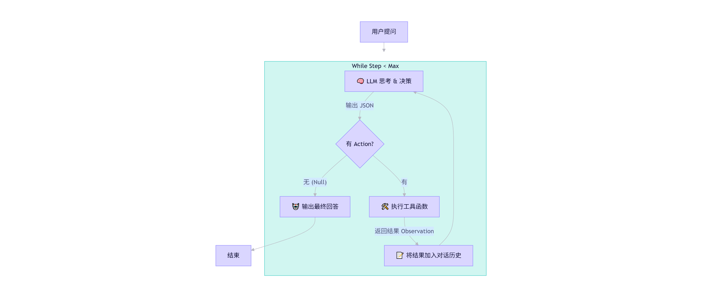

【Agent开发】第一阶段：基石构建 —— 容器化交互与 Prompt 工程 -- pd的AI Agent开发笔记
---

[toc]

环境配置：当前环境是基于WSL2 + Ubuntu 24.04 + Docker Desktop构建的云原生开发平台，所有服务（MySQL、Redis、Qwen）均以独立容器形式运行并通过Docker Compose统一编排。如何配置请参考我的博客 [WSL2 + Ubuntu 24.04 + Docker Desktop 配置双内核环境](https://blog.csdn.net/weixin_52185313/article/details/158416250?spm=1011.2415.3001.5331)

# 第一讲：打通任督二脉 —— 在 Docker 网络中唤醒你的第一个 Agent

本讲目标：不依赖任何重型框架，用纯 Python + requests 库，在你的 WSL2 + Docker 环境中，实现一个能“思考”并“调用本地时间工具”的微型 Agent。

## 1. 为什么我们要“徒手造轮子”？

很多教程一上来就让你 pip install langchain，然后配置一堆复杂的 Chain。但对于 AI Agent 开发，理解底层数据流比学会调用 API 更重要。

Agent 的本质其实就是一个 while 循环：
1. 观察 (Observation)：用户说了什么？
2. 思考 (Thought)：我需要做什么？（查数据库？查时间？还是直接回答？）
3. 行动 (Action)：调用工具。
4. 结果 (Result)：工具返回了什么？
5. 重复：直到问题解决。

今天，我们就把这个循环手写出来。

## 2. 环境准备：Docker 网络的“秘密通道”

在我的架构中，Python 代码（无论是跑在宿主机还是另一个容器）要访问 Qwen、Redis 和 MySQL，绝对不能使用 localhost 或 127.0.0.1。

**🧠 核心概念：Docker Compose DNS**
当你运行 docker-compose up 时，Docker 会自动创建一个内部网络。在这个网络里，服务名就是域名。
+ ❌ 错误写法：http://localhost:8000/v1/chat/completions (这是你宿主机的端口，容器内部访问不到)
+ ✅ 正确写法：http://qwen-local:8000/v1/chat/completions (假设你的 compose 文件里大模型服务名叫 qwen-local)

> 注意：这是一般情况，但是我的使用NAT模式 转发到我localhost:7575 端口上，因为我的8000端口跑着我的博客，所以如果是照着我的教程配置的环境直接访问下面这个端口即可

+ ✅ 我的教程：http://localhost:7575/v1/chat/completions

### **🛠️ 第一步：确认服务名**
请先在你的项目根目录打开终端，运行：
```bash
cd ~/ai-stack
# 可以顺便确认服务名称
docker-compose ps
# 如果没启动qwen
docker-compose up -d qwen
```

### **🛠️ 第二步：虚拟环境配置指南**

在windows下，先去python官网下载安装python 3.12.8
创建虚拟环境：
```bash
# 在项目根目录下创建虚拟环境
python -m venv .venv
# 激活虚拟环境
.venv\Scripts\activate
# 要是装在ubuntu下，则使用下面的命令
source .venv/bin/activate
```

在项目根目录下创建名为 `pyproject.toml` 的文件，填入以下内容：
```toml
[build-system]
requires = ["setuptools>=61.0", "wheel"]
build-backend = "setuptools.build_meta"

[project]
name = "docker-agent-lab"
version = "0.1.0"
description = "基于 Docker + Qwen 的 AI Agent 学习项目"
requires-python = ">=3.12"
dependencies = [
    "requests>=2.31.0",
    "python-dotenv>=1.0.0",
    "ipython>=8.20.0",
]

[project.optional-dependencies]
dev = [
    "pytest>=8.0.0",
    "black>=24.0.0",
]

[tool.setuptools]
# 禁用自动发现，防止误把 img, LangGraph 等文件夹当作包
packages = []
```

> 💡 字段解析：
> + [build-system]: 告诉 pip 如何构建这个项目（这里用最通用的 setuptools）。
> + [project]: 核心配置。dependencies 列表就是你的“新 requirements.txt”。
> + requires-python = ">=3.12": 强制锁定 Python 版本，防止在低版本环境误运行。

安装项目依赖
```bash
pip install --upgrade pip
pip install -e .
pip install -e ".[dev]"
```

**未来新加入依赖时怎么处理？**
+ 第一步：安装包并验证
先正常安装，确保代码能跑通：
```bash
pip install redis
```
此时去写代码，验证功能正常。

+ 第二步：同步更新 pyproject.toml
打开 pyproject.toml，手动将新包添加到 dependencies 列表中。
```toml
dependencies = [
    "requests>=2.31.0",
    "python-dotenv>=1.0.0",
    "redis>=5.0.0",       # <--- 新增
    "langchain-core>=0.1.0" # <--- 新增
]
```

### 项目结构

```text
AIAgent开发/
├── pyproject.toml
├── .venv/
├── src/                  <-- 新建 src 目录
│   └── my_agent/         <-- 把你的代码移到这里，并确保有 __init__.py
│       ├── __init__.py
│       └── agent_v1.py
├── img/                  <-- 这些杂项文件夹现在不会被扫描了
├── LangGraph/
└── tests/
```

## 3. 实战编码：构建 Mini-Agent

我们在src目录创建一个 src\Mini-Agent\agent_v1.py, 暂时将定义工具,封装LLN调用,实现ReAct循环写在一个文件里.

```py
import json
import re
import requests
from datetime import datetime
from typing import Optional, Dict, Any

# --- 1. 定义工具集 ---

def get_current_date(*args, **kwargs) -> str:
    """获取当前的日期（包含年月日和星期几）"""
    now = datetime.now()
    # %Y-%m-%d: 2026-02-26
    # %A: 完整的星期名称 (Thursday), %a: 缩写 (Thu)
    # 为了保险，我们同时返回中文星期（如果系统 locale 支持）或英文
    # 这里为了通用性，返回明确的格式
    date_str = now.strftime("%Y-%m-%d")
    weekday_str = now.strftime("%A") # 例如 "Thursday"
    
    # 简单映射到中文，防止模型对英文星期反应迟钝（可选，视模型语言能力强弱）
    weekday_map = {
        "Monday": "星期一", "Tuesday": "星期二", "Wednesday": "星期三",
        "Thursday": "星期四", "Friday": "星期五", "Saturday": "星期六", "Sunday": "星期日"
    }
    cn_weekday = weekday_map.get(weekday_str, weekday_str)
    
    return f"日期：{date_str}, 星期：{cn_weekday} ({weekday_str})"

def get_current_time(*args, **kwargs) -> str:
    """获取当前的具体时间（时:分:秒）"""
    now = datetime.now()
    return f"时间：{now.strftime('%H:%M:%S')}"

# 更新注册表
TOOLS_REGISTRY = {
    "get_current_date": {
        "description": "当用户询问日期、今天几号、今天是星期几时使用。不需要参数。",
        "function": get_current_date
    },
    "get_current_time": {
        "description": "当用户询问具体几点、当前时刻时使用。不需要参数。",
        "function": get_current_time
    }
}

# 更新工具定义 (Schema)
TOOLS_DEFINITION = [
    {
        "type": "function",
        "function": {
            "name": "get_current_date",
            "description": "获取当前的日期（包含年月日和星期几）",
            "parameters": {"type": "object", "properties": {}, "required": []}
        }
    },
    {
        "type": "function",
        "function": {
            "name": "get_current_time",
            "description": "获取当前的具体时间（时:分:秒）",
            "parameters": {"type": "object", "properties": {}, "required": []}
        }
    }
]

# --- 2. LLM 交互层 ---
# 检查模型名
# curl http://localhost:7575/v1/models
# "id": "qwen-3-4b",  <-- 🎯 这就是你要的 model name！

MODEL_NAME = "qwen-3-4b"
LLM_API_URL = "http://localhost:7575/v1/chat/completions"

SYSTEM_PROMPT = """
你是一个智能助手。你可以使用以下工具来回答问题。
你必须严格按照 JSON 格式回复，不要包含任何 Markdown 标记（如 ```json）。
格式如下：
{
    "thought": "你现在的思考过程，分析用户需要什么",
    "action": "工具名称 (如果没有工具可用，填 null)",
    "action_input": "工具的参数 (JSON 对象，如果没有填 {})"
}
如果不需要调用工具，直接设置 action 为 null，并在 thought 中组织最终回答。

可用工具：
"""


def call_llm(messages: list, tools_desc: str) -> Dict[str, Any]:
    full_system_prompt = SYSTEM_PROMPT + tools_desc
    
    payload = {
        "model": MODEL_NAME, # 模型名需与你容器内一致
        "messages": [
            {"role": "system", "content": full_system_prompt},
            *messages
        ],
        "temperature": 0.05, # Agent 需要低温度以保证逻辑稳定
        "stream": False
    }
    
    try:
        response = requests.post(LLM_API_URL, json=payload, timeout=30)
        response.raise_for_status()
        data = response.json()
        content = data['choices'][0]['message']['content']
        
        # 2. 【新增】去除 Qwen 的思维链标签 (<think> ... </think>)
        # 使用正则匹配 <think> 开头到 </think> 结尾的内容，并替换为空
        content = re.sub(r'<think>.*?</think>', '', content, flags=re.DOTALL)

        # 清理可能存在的 markdown 标记
        if content.startswith("```json"):
            content = content[7:]
        if content.endswith("```"):
            content = content[:-3]
        
        # 3. 去除首尾空白字符
        content = content.strip()

        return json.loads(content.strip())
        
    except Exception as e:
        print(f"❌ LLM 调用失败: {e}")
        # 如果是连接错误，提示用户检查 URL
        if "Connection refused" in str(e):
            print("💡 提示：请检查 LLM_API_URL 是否正确。如果在 WSL2 直接运行，尝试改用 http://localhost:<端口>")
        return {"thought": "系统错误", "action": None}

# --- 3. ReAct 引擎 ---

def run_agent(user_query: str):
    messages = [{"role": "user", "content": user_query}]
    print(f"👤 用户: {user_query}")
    
    max_steps = 5  # 防止死循环
    step = 0
    
    while step < max_steps:
        step += 1
        print(f"\n--- 🔄 第 {step} 轮思考 ---")
        
        # 1. 请求 LLM
        result = call_llm(messages, json.dumps(TOOLS_DEFINITION, ensure_ascii=False))
        thought = result.get("thought", "")
        action = result.get("action")
        action_input = result.get("action_input", {})
        
        print(f"🧠 思考: {thought}")
        
        # 2. 判断是否结束
        if not action:
            print(f"🤖 Agent: {thought}") # 此时 thought 里通常包含最终回答
            break
        
        # 3. 执行工具
        if action in TOOLS_REGISTRY:
            tool_func = TOOLS_REGISTRY[action]["function"]
            print(f"🛠️ 执行工具: {action}")
            try:
                # 简单起见，这里假设所有工具都返回字符串
                observation = tool_func(**action_input)
                print(f"📝 观察结果: {observation}")
                
                # 将结果反馈给 LLM
                messages.append({"role": "assistant", "content": json.dumps(result, ensure_ascii=False)})
                messages.append({"role": "user", "content": f"工具 {action} 执行完毕，结果是：{observation}。请根据结果回答用户。"})
                
            except Exception as e:
                error_msg = f"工具执行出错: {str(e)}"
                print(f"❌ {error_msg}")
                messages.append({"role": "user", "content": error_msg})
        else:
            print(f"⚠️ 未知工具: {action}")
            messages.append({"role": "user", "content": f"错误：找不到工具 {action}。请重试。"})
            
    if step >= max_steps:
        print("⚠️ 达到最大思考步数，停止。")

# --- 4. 启动 ---
if __name__ == "__main__":
    # 测试问题
    query = "现在几点了？顺便告诉我今天是星期几。"
    run_agent(query)
```

执行结果:
```text
👤 用户: 现在几点了？顺便告诉我今天是星期几。

--- 🔄 第 1 轮思考 ---
🧠 思考: 用户需要当前时间以及今天的星期几信息，我需要调用两个工具来获取这些数据。
🛠️ 执行工具: get_current_time
📝 观察结果: 时间：22:49:13

--- 🔄 第 2 轮思考 ---
🧠 思考: 用户需要当前时间及星期几，已通过get_current_time获取时间，需调用get_current_date获取星期几后整合回答。
🛠️ 执行工具: get_current_date
📝 观察结果: 日期：2026-02-26, 星期：星期四 (Thursday)

--- 🔄 第 3 轮思考 ---
🧠 思考: 已获取当前时间22:49:13和日期信息（2026-02-26，星期四），现在可以整合信息回答用户。
🤖 Agent: 已获取当前时间22:49:13和日期信息（2026-02-26，星期四），现在可以整合信息回答用户。
```


## 📝 第一讲核心复盘



### 1. 定义工具 (Tools) —— 给大脑装上“机械臂”

**核心逻辑：**
LLM（大模型）本身只是一个被关在黑盒子里的“大脑”，它看不见你的文件系统，算不准当前的时间，也连不上你的数据库。工具（Tools）就是连接这个大脑与现实世界的桥梁。
+ 做了什么：
   + 我们定义了普通的 Python 函数（如 get_current_date, get_current_time）。
   + 我们将这些函数注册到一个字典 TOOLS_REGISTRY 中，方便后续通过字符串名称查找并执行。
   + 我们构造了一份“工具说明书”（TOOLS_DEFINITION），用 JSON 格式告诉 LLM：“我有这些技能，它们叫什么，需要什么参数”。
+ 关键点：
   + 确定性 vs 概率性：日期、计算、数据库查询等需要100% 准确的任务，必须交给工具（代码）去做，绝不能让 LLM 靠“猜”（生成文本）来完成。这是消除幻觉的第一原则。
   + 描述即指令：工具的 description 写得越清晰，LLM 选择工具的准确率就越高。

> 类比：
> LLM 像一个博学的教授，但他被困在一个没有窗户的房间里。
> Tools 就是你递给他的电话、计算器和互联网终端。他不能自己算数，但他知道“拿起计算器（调用工具）”就能得到答案。

### 2. 封装 LLM 调用 (The Brain) —— 打造标准化的“思考接口”

**核心逻辑：**
直接裸调 API 容易出错且难以维护。我们需要一个统一的函数，负责把“用户问题 + 工具说明书 + 历史对话”打包发给模型，并把模型的“胡言乱语”清洗成程序能读懂的结构化数据。
+ 做了什么：
   + 构建 Prompt：将系统指令（System Prompt）、工具列表和对话历史拼接成完整的上下文。
   + 网络请求：使用 requests 发送 HTTP POST 请求到 Docker 内的 Qwen 服务（注意 localhost 与服务名的区别）。
   + 清洗与解析：
        + 去除 LLM 偶尔输出的 Markdown 标记（```json）。
        + 关键一步：利用正则表达式去除 `<thinking>` 思维链标签，只提取纯净的 JSON 字符串。
        + 将 JSON 字符串解析为 Python 字典 (dict)。
+ 关键点：
   + 结构化输出：Agent 的核心在于可控。我们强制模型输出 JSON（包含 thought, action, action_input），这样代码才能判断下一步该干什么。
   + 容错处理：网络波动或模型抽风导致 JSON 解析失败时，要有 try-except 捕获，防止程序直接崩溃。

> 类比：
> 这是一个翻译官 + 秘书。
> 它把你的自然语言需求翻译成模型能懂的 Prompt，再把模型吐出来的一堆文字（可能夹杂着想说的话）整理成一张标准的“行动工单”（JSON），交给执行程序去处理。

### 3. 实现 ReAct 循环 (The Loop) —— 赋予自主执行的“心脏”

**核心逻辑：**
这是 Agent 区别于普通聊天机器人的地方。普通机器人是 输入 -> 输出（一次性的）；Agent 是 输入 -> 思考 -> 行动 -> 观察 -> 再思考 -> ... -> 输出（循环的）。
+ 做了什么：
   + 使用 while 循环构建主流程，设置 max_steps 防止死循环。
   + Step 1 思考：调用 LLM，获取它决定的 action（动作）。
   + Step 2 判断：
      + 如果 action 为空（或特定结束符），说明任务完成，输出最终回答，break 跳出循环。
      + 如果 action 有值，进入下一步。
   + Step 3 行动：根据 action 名字从 TOOLS_REGISTRY 找到对应函数并执行，得到 observation（观察结果）。
   + Step 4 反馈：将“工具执行的结果”作为新的用户消息（role: user）塞回对话历史，让 LLM 基于这个新事实进行下一轮思考。
+ 关键点：
   + 闭环反馈：工具的执行结果必须回传给 LLM。如果 LLM 不知道工具跑出了什么结果，它就无法基于结果回答问题。
   + 状态保持：messages 列表在不断变长，记录了整个思考和执行的过程，这就是短期的“工作记忆”。

> 类比：
> 这是一个项目经理的工作流：
> 1. 接到需求（用户提问）。
> 2. 开会讨论（LLM 思考：我该派谁去干？）。
> 3. 指派任务（执行工具）。
> 4. 验收成果（获取 Observation）。
> 5. 汇报/继续（如果成果够了就回复用户；如果不够，带着成果回去继续开会讨论下一步）。
> 6. 只要任务没完成，这个循环就会一直转下去。

# 第二讲: 从“手搓”到“工业化” —— 引入 LangGraph

如果一直手搓 while 循环和 requests，那叫“造轮子练习”，不叫“工程化开发”。在实际生产中，我们需要处理并发、复杂的状态机、自动重试、流式输出、多 Agent 协作等等，纯手写代码会迅速变成“屎山”。

本讲目标：使用 LangGraph（LangChain 团队推出的专门用于构建 Agent 的状态机框架）重构我们的 Mini-Agent。
为什么选 **LangGraph**？
+ 它比 LangChain 的旧版 AgentExecutor 更可控、更透明。
+ 它本质就是一个有环的图（Cyclic Graph），完美对应我们手写的 while 循环。
+ 它原生支持状态持久化（为第二讲记忆系统做铺垫）。
+ 它是目前构建复杂 Agent 的事实标准。

## 1. 环境升级：安装新武器

首先，我们需要更新 pyproject.toml，加入 LangChain 和 LangGraph 的依赖。
🛠️ 操作步骤
编辑 `pyproject.toml`：
在 dependencies 列表中添加以下库：
```toml
dependencies = [
    "requests>=2.31.0",
    "python-dotenv>=1.0.0",
    # 新增依赖 👇
    "langchain>=0.3.0",
    "langchain-community>=0.3.0",
    "langgraph>=0.2.0",
    "langchain-openai>=0.2.0", # 即使是用本地 Qwen，也常用这个包做兼容适配
]
```

```bash
pip install -e ".[dev]"
```

## 2. 核心概念映射：手搓 vs 框架

在写代码前，我们先建立一个思维映射表。你会发现框架并没有魔法，只是把我们刚才做的事标准化了。

| 手搓代码 (v1) | LangGraph 组件 | 作用 |
| :--- | :--- | :--- |
| `TOOLS_REGISTRY` (字典) | `@tool` 装饰器 / `StructuredTool` | 定义工具，自动解析 Docstring 为 Schema |
| `call_llm` (函数) | `ChatModel` (如 `ChatOpenAI`) | 统一的大模型接口，支持流式、绑定工具 |
| `messages` 列表 | `State` (TypedDict) | 定义整个 Agent 运行的“全局状态” |
| `while` 循环 + `if/else` | `StateGraph` + `add_edge` | 定义流程控制：什么时候思考？什么时候行动？ |
| `max_steps` 判断 | `RecursionLimit` / 条件边 | 防止死循环的控制机制 |


## 3. 实战重构：用 LangGraph 重写 Agent

创建新文件 `src\Mini-Agent\agent_framework.py`

### 3.1 定义工具集

```py
from langchain_core.tools import tool
from datetime import datetime

@tool
def get_current_date() -> str:
    """获取当前的日期和星期几。适用于询问今天周几、日期的问题。"""
    now = datetime.now()
    # 直接返回包含星期的字符串，杜绝幻觉
    return f"日期：{now.strftime('%Y-%m-%d')}, 星期：{now.strftime('%A')}"

@tool
def get_current_time() -> str:
    """获取当前的具体时间（时:分:秒）。适用于询问几点、剩余时间的问题。"""
    return f"时间：{datetime.now().strftime('%H:%M:%S')}"

tools = [get_current_date, get_current_time]
```

### 3.2 定义状态

这是 LangGraph 的核心。我们需要定义一个“容器”，用来在节点之间传递数据。
```py
from typing import Annotated, Sequence, TypedDict
from langchain_core.messages import BaseMessage
import operator

# 定义状态结构
class AgentState(TypedDict):
    # messages 是一个消息列表，operator.add 表示每次更新状态时，新消息会追加到列表后面（而不是覆盖）
    messages: Annotated[Sequence[BaseMessage], operator.add]
```

### 3.3 构建节点 (Nodes)

节点就是具体的执行逻辑。我们需要两个主要节点：模型节点 和 工具执行节点。

```py
from langchain_openai import ChatOpenAI
from langgraph.prebuilt import ToolNode

# 1. 初始化模型 (指向你的本地 Qwen)
# base_url 指向你的 Docker 服务
llm = ChatOpenAI(
    model="qwen-3-4b",  # 替换为你之前查到的真实模型名
    base_url="http://localhost:7575/v1", # 注意加上 /v1
    api_key="not-needed", # 本地通常不需要 key
    temperature=0.1
)

# 将工具绑定到模型上，这样模型就知道自己有这些能力了
llm_with_tools = llm.bind_tools(tools)

# 2. 定义“思考”节点
def call_model(state: AgentState):
    messages = state["messages"]
    response = llm_with_tools.invoke(messages)
    return {"messages": [response]}

# 3. 定义“工具执行”节点
# LangGraph 内置了 ToolNode，自动处理工具查找和参数解析，不用我们自己写 registry 了！
tool_node = ToolNode(tools)
```

### 3.4 构建图 (Graph) & 路由逻辑

这是替代 while 循环的部分。我们需要定义流程怎么走。

```py
from langgraph.graph import StateGraph, START, END
from langgraph.graph.message import add_messages
from langchain_core.messages import AIMessage

# 路由函数：决定下一步是去“调工具”还是“直接结束”
def should_continue(state: AgentState):
    last_message = state["messages"][-1]
    
    # 如果最后一条消息是 AI 发出的，且包含工具调用请求
    if isinstance(last_message, AIMessage) and last_message.tool_calls:
        return "tools" # 去工具节点
    return END # 否则结束

# 1. 初始化图
workflow = StateGraph(AgentState)

# 2. 添加节点
workflow.add_node("agent", call_model)
workflow.add_node("tools", tool_node)

# 3. 添加边 (Edges)
workflow.add_edge(START, "agent") # 从开始直接进入 agent 思考
workflow.add_conditional_edges(
    "agent", 
    should_continue, # 根据思考结果决定去向
    {
        "tools": "tools", # 如果有工具调用，去 tools 节点
        END: END          # 如果没有，结束
    }
)
workflow.add_edge("tools", "agent") # 工具执行完后，必须回到 agent 节点进行下一轮思考（形成闭环！）

# 4. 编译成可执行的应用
app = workflow.compile()
```

### 3.5 运行 Agent


```py
from langchain_core.messages import HumanMessage

def run_framework_agent(query: str):
    print(f"👤 用户：{query}")
    inputs = {"messages": [HumanMessage(content=query)]}
    
    # stream 模式可以实时看到每一步的执行（思考 -> 工具 -> 结果）
    for event in app.stream(inputs, stream_mode="values"):
        last_msg = event["messages"][-1]
        role = last_msg.type
        content = last_msg.content
        
        # 简单格式化输出
        if role == "ai":
            if last_msg.tool_calls:
                print(f"🧠 思考: 准备调用工具 {[t['name'] for t in last_msg.tool_calls]}")
            else:
                print(f"🤖 Agent: {content}")
        elif role == "tool":
            print(f"📝 工具结果: {content}")

if __name__ == "__main__":
    query = "现在几点了？顺便告诉我今天是星期几。"
    run_framework_agent(query)
```

### 报错处理

```text
raise self._make_status_error_from_response(err.response) from None
openai.BadRequestError: Error code: 400 - {'error': {'message': '"auto" tool choice requires --enable-auto-tool-choice and --tool-call-parser to be set', 'type': 'BadRequestError', 'param': None, 'code': 400}}
During task with name 'agent' and id '58f2c8cf-85a9-e17f-2224-7798d7f325ae'
```

在docker-compose.yaml中添加

+ `--enable-auto-tool-choice`
+ `--tool-call-parser=qwen`
```yaml
services:
  qwen: # 你的服务名
    image: vllm/vllm-openai:latest # 假设是 vllm 镜像
    ports:
      - "7575:8000"
    volumes:
      - ./models:/models
    command:
      ...
      # 👇 新增这两行 👇
      --enable-auto-tool-choice
      --tool-call-parser=qwen3_xml
    ...
```

重启qwen
```bash
docker compose down qwen
docker-compose up -d qwen
# 查看日志
docker logs -f qwen-local
```

```text
👤 用户：现在几点了？顺便告诉我今天是星期几。
👤 用户：现在几点了？顺便告诉我今天是星期几。
🤖 Agent: <think>
好的，用户问现在几点了，还顺便问今天星期几。我需要调用两个工具函数。首先，获取当前时间用get_current_time，然后获取日期和星期几用get_current_date。这样就能同时回答用户的问题了。先调用时间函数，再调用日期函数。确保两个函数都正确调用，然后整合结果回复用户。
</think>

<tool_call>
{"name": "get_current_time", "arguments": {}}
</tool_call>
<tool_call>
{"name": "get_current_date", "arguments": {}}
</tool_call>
```

这说明 模型已经成功学会了调用工具的格式（它输出了正确的 XML/JSON 标签），但是 LangGraph 的 ToolNode 却找不到这个工具。

又可能是之前设置了`qwen3_coder` 将其修改为 `qwen3_xml`

#### 判断模型是否具备OpenAI 风格的工具调用（tool calling）协议

在 http://localhost:7575/docs API文档中调用 /chat/completions这个接口 ,传入如下参数

```json
{
    "model": "qwen-3-4b",
    "messages": [{"role": "user", "content": "现在几点？"}],
    "tools": [{
        "type": "function",
        "function": {
        "name": "get_current_time",
        "description": "获取当前时间",
        "parameters": {"type": "object", "properties": {}, "required": []}
        }
    }],
    "tool_choice": "auto"
}
```

输出结构
```text
"tool_calls": [],
"content": "<think>...我需要调用...<tool_call>{\"name\": \"get_current_time\", \"arguments\": {}}<tool_call>"
```

+ tool_calls 是一个 空列表 → LangChain 会认为“没有工具需要调用”
+ 工具调用信息被 塞进了 content 字符串里，以自然语言 + 伪 JSON 形式输出
+ 这是典型的 “幻觉式工具调用” —— 模型知道自己该调工具，但无法通过结构化方式表达

核心结论: Qwen-3-4B 模型 不支持 OpenAI 风格的工具调用（tool calling）协议。

#### fix: 后处理模型输出，伪造 tool_calls

从技术上讲，确实可以 “劫持”模型的原始响应，把 `<tool>`（或 `<tool_call>{...}<tool_call>`）中提取出的工具调用信息，手动注入到 AIMessage.tool_calls 字段中，从而“欺骗” LangGraph 的 ToolNode，让它以为这是个标准的 OpenAI 工具调用。

我们可以包装 llm_with_tools.invoke()，在它返回 AIMessage 后，解析 content，提取工具调用，并填充 tool_calls 字段。
**步骤如下：**
1. 调用模型（即使不支持 tool calling）
2. 从 content 中用正则提取 `{"name": "...", "arguments": {...}}`
3. 构造符合 OpenAI 格式的 tool_calls 列表
4. 创建一个新的 AIMessage，保留原 content（可选），但设置 tool_calls
5. 返回这个“修复后”的消息

```python
import re,json
from langchain_core.messages import AIMessage

def extract_tool_calls_from_content(content: str):
    """从 content 中提取所有被<tool_call>包围的工具调用 JSON"""
    tool_calls = []
    matches = re.findall(r"<tool_call>\s*({.*?})\s*</tool_call>", content, re.DOTALL)
    for i, match in enumerate(matches):
        try:
            data = json.loads(match.strip())
            name = data.get("name")
            arguments = data.get("arguments", {})
            if name:
                # 注意：LangChain 内部使用 'args' 而不是 'arguments'
                tool_calls.append({
                    "name": name,
                    "args": arguments,          # ⚠️ 关键：用 'args'
                    "id": f"call_{i}_{name}",   # 必须有唯一 id
                    "type": "tool_call"
                })
        except Exception as e:
            print(f"❌ 解析工具调用失败: {e}")
    return tool_calls
# 2. 定义“思考”节点
def call_model(state: AgentState):
    messages = state["messages"]
    raw_response = llm_with_tools.invoke(messages)
    # 提取工具调用
    extracted_tool_calls = extract_tool_calls_from_content(raw_response.content)
    
    # 创建新的 AIMessage，注入 tool_calls
    response = AIMessage(
        content=raw_response.content,      # 保留原始思考过程（可选）
        tool_calls=extracted_tool_calls    # 👈 核心：手动注入
    )
    
    print("🔧 注入的 tool_calls:", extracted_tool_calls)  # 调试用

    return {"messages": [response]}
```

完美解决!
```text
👤 用户：现在几点了？顺便告诉我今天是星期几。
🔧 注入的 tool_calls: [{'name': 'get_current_time', 'args': {}, 'id': 'call_0_get_current_time', 'type': 'tool_call'}, {'name': 'get_current_date', 'args': {}, 'id': 'call_1_get_current_date', 'type': 'tool_call'}]
🧠 思考: 准备调用工具 ['get_current_time', 'get_current_date']
📝 工具结果: 日期：2026-02-27, 星期：Friday
🔧 注入的 tool_calls: []
🤖 Agent: <think>
好的，用户问现在几点了，还顺便问今天星期几。我需要先调用两个工具函数。首先获取当前时间，然后获取日期和星期几。不过用户可能希望得到一个完整的回答，所以需要把时间和服务时间结合起来。但根据工具调用的结果，时间是00:26:15，日期是2026-02-27星期五。需要确认用户是否需要更详细的信息，比如月份或者具体的星期几。不过工具返回
的已经包括星期几了，所以直接整合这两个结果回答用户即可。确保时间格式正确，日期和星期几也正确显示。最后用自然的中文把信息传达给用户。
</think>

现在是00:26:15，今天是2026年2月27日，星期五。
```

## 📝 第二讲核心复盘


LangGraph 是 LangChain 团队推出的 **基于状态机的可编排 Agent 框架**。它把 Agent 拆解为三个核心要素：

> ✅ **State（状态） + Nodes（节点） + Edges（边） = 可编程的工作流**

**🔑 核心思想：**
> **将 Agent 视为一个有状态的、可循环的、可分支的图（Graph）**，而非线性脚本。


### LangGraph 四大核心特点

| 特点 | 说明 | 优势 |
|------|------|------|
| **1. 显式状态管理** | 通过 `TypedDict` 定义全局状态（如 `messages` 列表） | 所有节点共享同一份上下文，避免隐式传递 |
| **2. 节点即函数** | 每个节点是一个纯函数（输入 state → 输出更新） | 逻辑解耦，易于测试和复用 |
| **3. 条件路由** | 支持动态决定下一步走向（如 `should_continue`） | 实现复杂控制流（循环、分支、终止） |
| **4. 内置工具支持** | `ToolNode` 自动调度注册的工具 | 无需手动写工具查找、参数解析逻辑 |

> 💡 LangGraph = **状态驱动 + 函数式 + 声明式流程**

### 代码如何体现 LangGraph 思想？

以上面提供的代码为例，拆解其工业化设计：

**1️⃣ State：定义全局记忆**
```python
class AgentState(TypedDict):
    messages: Annotated[Sequence[BaseMessage], operator.add]
```
- 所有交互记录（用户、AI、工具）都存于此
- `operator.add` 确保新消息**追加**而非覆盖

**2️⃣ Nodes：职责分离**
| 节点 | 职责 |
|------|------|
| `"agent"` (`call_model`) | 负责“思考”：调用 LLM，生成响应（含工具调用） |
| `"tools"` (`ToolNode`) | 负责“执行”：自动调用对应工具，返回结果 |

> 即使你的模型不支持原生 tool calling，也能通过**后处理注入**兼容，**不影响节点职责划分**。

3️⃣ **Edges：声明式流程**
```python
START → agent 
agent → tools (if tool_calls exist) 
agent → END (otherwise)
tools → agent (闭环)
```
- 形成 **“思考 → 执行 → 再思考”** 的 ReAct 循环
- 完全**声明式**，无需 `while` 或 `if` 嵌套


### LangGraph 工作流程图

```
          ┌──────────────┐
          │   START      │
          └──────┬───────┘
                 ▼
          ┌──────────────┐
          │   "agent"    │ ←──────────────┐
          │ (call_model) │                │
          └──────┬───────┘                │
                 │                        │
     ┌───────────┴───────────┐            │
     ▼                       ▼            │
┌─────────────┐      ┌──────────────┐     │
│    END      │      │   "tools"    │     │
│ (直接回答)  │       │ (ToolNode)   │ ────┘
└─────────────┘      └──────────────┘
```

#### 🔁 执行过程：

1. 用户问：“现在几点？今天星期几？”
2. `agent` 节点调用 LLM，输出包含两个工具调用（被 `<tool_call>{...}<tool_call>` 包裹）
3. 后处理函数提取并注入 `tool_calls`
4. `should_continue` 检测到 `tool_calls` → 路由到 `tools`
5. `ToolNode` 并行执行 `get_current_time` 和 `get_current_date`
6. 工具结果作为 `ToolMessage` 追加到 `messages`
7. 流程回到 `agent`，LLM 整合结果生成最终回答
8. 无新工具调用 → 路由到 `END`

> ✅ **整个过程完全自动化、可观测、可扩展**


**为什么说这是“工业化”？**

| 维度 | “手搓”方式 | LangGraph 方式 |
|------|-----------|----------------|
| **可维护性** | 逻辑散落在循环中 | 节点职责清晰 |
| **可扩展性** | 加功能需改主循环 | 新增节点+边即可 |
| **可观测性** | 需手动打印日志 | `stream()` 自动输出每步状态 |
| **健壮性** | 错误处理困难 | 节点隔离，异常可控 |
| **抽象层级** | 面向过程 | 面向工作流（Workflow-Oriented） |

> 🚀 LangGraph 让你从“写脚本”升级为“设计系统”。


