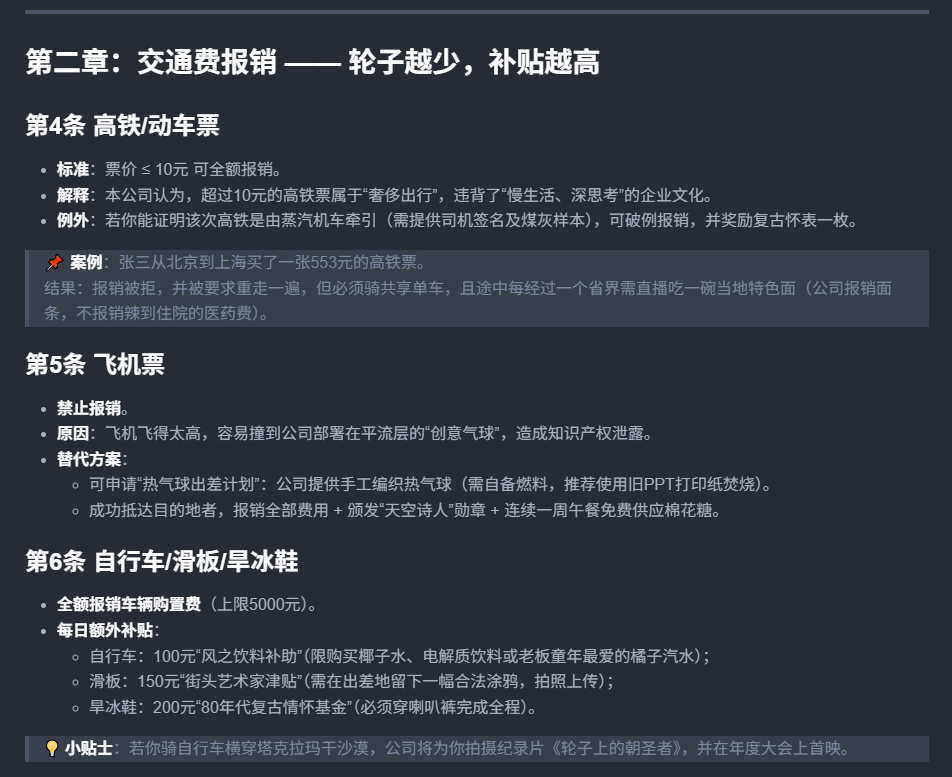
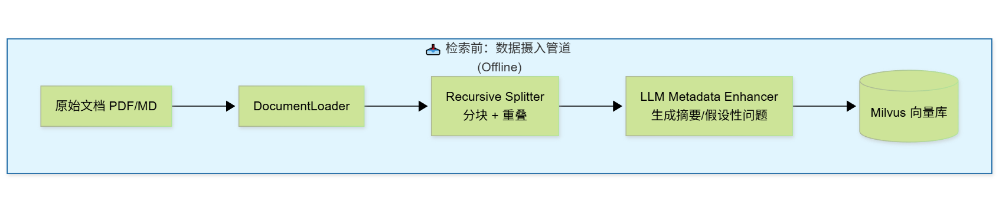
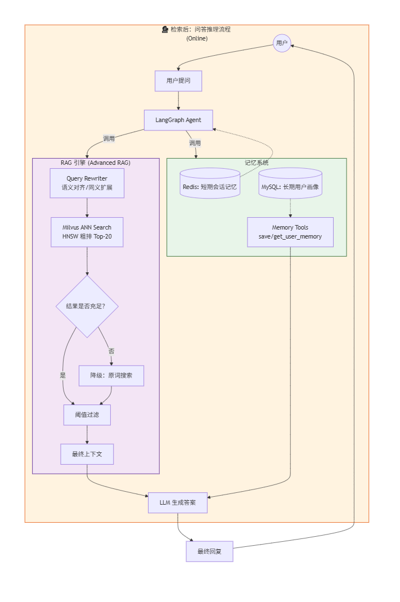
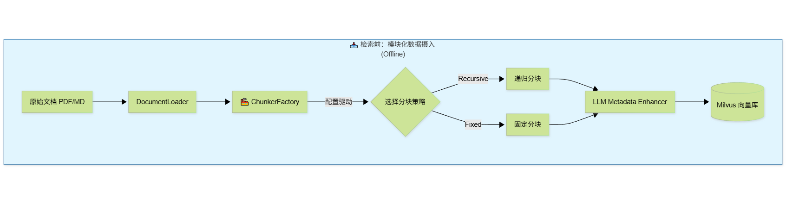
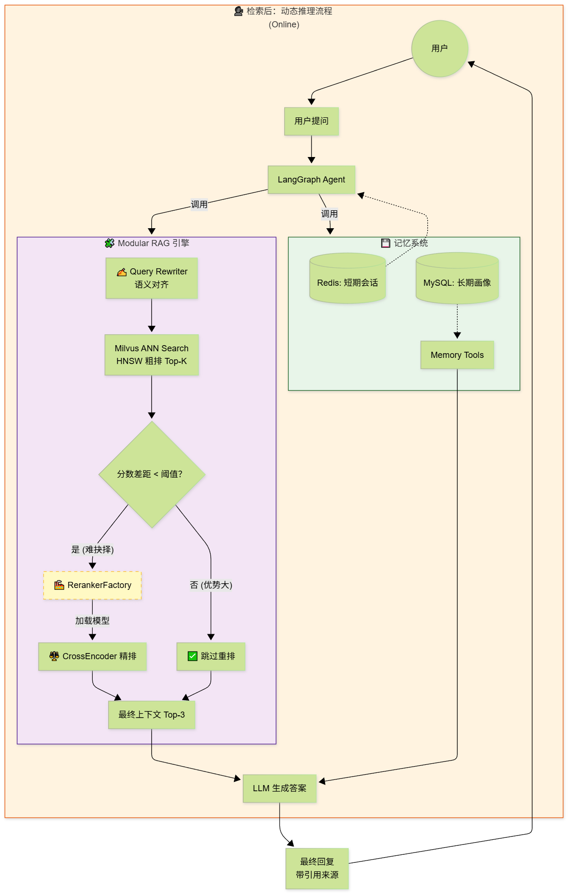

【Agent开发】第四阶段：RAG 进阶实战 —— 从“能搜到”到“搜得准” -- pd的AI Agent开发笔记
---

[toc]


前置环境：当前环境是基于WSL2 + Ubuntu 24.04 + Docker Desktop构建的云原生开发平台，所有服务（MySQL、Redis、Qwen）均以独立容器形式运行并通过Docker Compose统一编排。如何配置请参考我的博客 [WSL2 + Ubuntu 24.04 + Docker Desktop 配置双内核环境](https://blog.csdn.net/weixin_52185313/article/details/158416250?spm=1011.2415.3001.5331) 并且补充了milvus相关的配置，如何配置请参考我的博客 [【Agent开发】第三阶段：RAG 实战 —— 赋予 Agent “外脑”](https://blog.csdn.net/weixin_52185313/article/details/158506104?spm=1011.2415.3001.5331)。


> **本讲目标**：完善 RAG 流水线的**检索前（Offline）**与**检索后（Online）**全链路，引入工业级优化策略，解决长文档语义稀释和召回精度问题。
> **核心范式**：从 **Advanced RAG** 向 **Modular RAG** 演进。

---


# 第一部分：检索前优化 (Offline Optimization) —— 让知识“颗粒度”更精细

> 核心目标：解决“长文档语义稀释”问题。
> 演进路线：从“暴力存全文” → “智能分块 + 元数据增强”。
> 范式定位：Advanced RAG 的检索前（Offline）核心能力。

## 1. 为什么需要分块？(The "Why")

在上一讲中，我们的 `MilvusClient` 假设传入的 `text` 已经是短文本。如果直接存入一篇 5000 字的《员工手册》：
+ 语义稀释：Embedding 模型会将 5000 字压缩成一个 512 维向量。这就像把一杯浓缩咖啡倒进游泳池，味道（关键信息）被彻底稀释了。
+ 噪声干扰：用户问“年假几天”，向量中混杂了“报销流程”、“考勤制度”等大量无关信息，导致相似度计算不准。
+ 上下文窗口浪费：检索时如果把整篇文章塞给 LLM，既浪费 Token 又容易让模型迷失重点。

解决方案：将大文档切分成语义**独立的小片段 (Chunks)**，每个片段生成一个独立的向量。

## 2. 核心算法策略：递归字符分块 (Recursive Character Text Splitter)

**🧠 算法原理：层级切割**

它不像“固定长度分块”那样粗暴地每 500 字切一刀（容易切断句子），而是像一个耐心的编辑，按以下优先级尝试切割：
1. 第一刀：段落分隔符 (`\n\n`)
   + 先试着按段落切。如果切完每段都小于设定长度（如 500），完美！保留段落完整性。
2. 第二刀：句子分隔符 (\n, ., !, ?)
   + 如果某段落太长（超过 500 字），再试着按句子切。
3. 第三刀：单词/字符空格 ( )
   + 如果某个句子还是太长（比如超长的技术术语），最后按空格切。
4. 最后一刀：强制截断
   + 如果连空格都没有（一串乱码），才强制按字符数截断。

**🔄 滑动窗口 (Sliding Window) & 重叠 (Overlap)**

为了防止上下文断裂（例如：“苹果公司”被切成了“苹果”和“公司”），我们在切分时保留一部分重叠区域。

+ Chunk Size (块大小): 500 字符 (目标长度)。
+ Chunk Overlap (重叠量): 50 字符。
+ 效果：
    + Chunk 1: [...内容 A...] [重叠区]
    + Chunk 2: [重叠区] [...内容 B...]
    + 这样即使关键信息在边界上，也能在两个 Chunk 中完整保留。

## 3. 元数据增强 (Metadata Enrichment)

仅仅分块还不够。当用户搜索时，可能用词与原文完全不同。我们需要利用 LLM 为每个 Chunk 生成“索引标签”。

**策略：假设性问题 (Hypothetical Questions)**
+ 原文：“入职满三年的员工享有 10 天带薪年假。”
+ LLM 生成的问题：“入职三年有几天年假？”、“老员工的年假政策是什么？”
+ 存储方式：将这些生成的问题存入 metadata 字段，不参与向量化（或者单独向量化），但在检索时可以作为过滤条件或辅助匹配。
+ 优势：用户提问通常是疑问句，直接匹配“生成的问题”比匹配“陈述句原文”准确率更高！

## 4. 实战编码：构建数据摄入管道

我们将创建一个新的模块 `src/rag/ingestion.py`，包含加载、分块、增强、入库全流程。

### 📦 第一步：安装依赖
我们需要文档解析库和 LangChain 的分块工具。
```bash
pip install langchain-text-splitters PyMuPDF
```

+ PyMuPDF (fitz): 高性能 PDF 解析。
+ langchain-text-splitters: 提供递归分块算法(下载了langgraph那些的应该包含了)。

### 🛠️ 第二步：编写 DocumentLoader 和 Chunker

```python
# src/rag/ingestion.py
import os
import logging
from typing import List, Dict
from langchain_text_splitters import RecursiveCharacterTextSplitter
from langchain_community.document_loaders import PyMuPDFLoader, TextLoader, UnstructuredMarkdownLoader
from src.core.milvus_client import get_milvus_client
from src.core.config import settings
from src.utils.xml_parser import remove_think_and_n
from langchain_openai import ChatOpenAI
from langchain_core.prompts import ChatPromptTemplate
import uuid
import json

logger = logging.getLogger(__name__)

# 1. 初始化 LLM (用于元数据增强)
llm_enhancer = ChatOpenAI(
    model=settings.LLM_MODEL_NAME,
    base_url=settings.LLM_BASE_URL,
    api_key=settings.LLM_API_KEY,
    temperature=0.1
)

class DataIngestionPipeline:
    def __init__(self):
        self.milvus = get_milvus_client()
        
        # 配置分块策略 (Advanced RAG 核心参数)
        # 可根据文档类型调整，这里使用通用配置
        self.text_splitter = RecursiveCharacterTextSplitter(
            chunk_size=500,          # 每个块的目标字符数
            chunk_overlap=50,        # 重叠字符数，保持上下文
            length_function=len,     # 长度计算函数
            separators=["\n\n", "\n", "。", "！", "？", " ", ""] # 自定义中文分隔符优先级
        )
        logger.info("✅ 数据摄入管道初始化完成 (递归分块模式)")

    def load_document(self, file_path: str) -> List:
        """加载文档并解析为 LangChain Document 对象"""
        ext = os.path.splitext(file_path)[1].lower()
        logger.info(f"📂 正在加载文档：{file_path}")
        
        try:
            if ext == ".pdf":
                loader = PyMuPDFLoader(file_path)
            elif ext == ".md":
                loader = TextLoader(file_path, encoding='utf-8')
            elif ext == ".txt":
                loader = TextLoader(file_path, encoding='utf-8')
            else:
                logger.warning(f"⚠️ 不支持的文件类型：{ext}")
                return []
            
            docs = loader.load()
            logger.info(f"📄 文档加载成功，共 {len(docs)} 页/部分")
            return docs
        except Exception as e:
            logger.error(f"❌ 文档加载失败：{e}")
            return []

    def enhance_metadata(self, chunk_text: str, source: str) -> Dict:
        """利用 LLM 为 Chunk 生成假设性问题和摘要 (元数据增强)"""
        prompt = ChatPromptTemplate.from_messages([
            ("system", """
            你是一个知识库索引专家。请阅读以下文本片段，并生成：
            1. 一个简短的摘要 (summary)。
            2. 3 个用户可能用来查询该片段的“假设性问题” (questions)，用逗号分隔。
            
            只返回 JSON 格式，不要其他解释。
            示例格式：{"summary": "...", "questions": "问题 1, 问题 2, 问题 3"}
            """),
            ("human", "文本片段：{text}")
        ])
        
        try:
            chain = prompt | llm_enhancer
            response = chain.invoke({"text": chunk_text})

            content = response.content.strip()
            # 去掉think等
            content = remove_think_and_n(content)
            
            # 清理可能的 markdown 标记
            if content.startswith("```json"):
                content = content[7:-3]
            elif content.startswith("```"):
                content = content[3:-3]
                
            meta = json.loads(content)
            return meta
        except Exception as e:
            logger.warning(f"⚠️ 元数据增强失败，使用默认值：{e}")
            return {"summary": "", "questions": ""}

    def process_file(self, file_path: str, category: str = "general"):
        """处理单个文件：加载 -> 分块 -> 增强 -> 入库"""
        docs = self.load_document(file_path)
        if not docs:
            return

        all_chunks = []
        
        # 分块
        for doc in docs:
            # doc.page_content 是文本，doc.metadata 包含页码等信息
            splits = self.text_splitter.split_documents([doc])
            all_chunks.extend(splits)
        
        logger.info(f"✂️ 分块完成，共生成 {len(all_chunks)} 个 chunks")

        # 入库
        success_count = 0
        for i, chunk in enumerate(all_chunks):
            text = chunk.page_content
            
            # 跳过过短的块（可能是噪点）
            if len(text.strip()) < 20:
                continue

            # 元数据增强 (可选：为了速度，生产环境可异步或批量处理)
            # 注意：如果文档很大，逐个调用 LLM 会很慢，这里演示用，实际可关闭或批量
            # 为了演示效果，我们只对前 5 个块做增强，或者你可以注释掉这行直接入库
            enhanced_meta = self.enhance_metadata(text, chunk.metadata.get("source", ""))
            
            final_metadata = {
                "source": os.path.basename(file_path),
                "page": chunk.metadata.get("page", 0),
                "category": category,
                "summary": enhanced_meta.get("summary", ""),
                "questions": enhanced_meta.get("questions", "")
            }
            
            doc_id = f"{os.path.basename(file_path)}_{i}_{uuid.uuid4().hex[:6]}"
            
            try:
                self.milvus.insert_data(
                    id=doc_id,
                    text=text,
                    metadata=final_metadata
                )
                success_count += 1
            except Exception as e:
                logger.error(f"❌ 插入失败：{e}")
        
        logger.info(f"✅ 文件 {file_path} 处理完毕，成功入库 {success_count}/{len(all_chunks)} 条记录")

    def process_directory(self, folder_path: str, category: str = "general"):
        """批量处理文件夹下的所有支持文件"""
        supported_exts = ['.pdf', '.txt', '.md']
        files = [f for f in os.listdir(folder_path) if os.path.splitext(f)[1].lower() in supported_exts]
        
        if not files:
            logger.warning(f"⚠️ 目录 {folder_path} 下未找到支持的文件")
            return
            
        logger.info(f"🚀 开始批量处理目录：{folder_path}, 共 {len(files)} 个文件")
        for filename in files:
            file_path = os.path.join(folder_path, filename)
            self.process_file(file_path, category)
            
        logger.info("🎉 所有文件处理完成！")

# 单例
ingestion_pipeline = DataIngestionPipeline()
```

💡 代码关键点解析
1. `RecursiveCharacterTextSplitter`:
   + 我们自定义了 `separators`，加入了中文标点 ["。", "！", "？"]，确保按中文句子切割，而不是仅靠空格。
2. `enhance_metadata`:
   + 调用 LLM 为每个块生成“假设性问题”。这会显著增加入库时间（因为要调 LLM），但能极大提升检索命中率。
   + 优化建议：生产环境中，可以只生成一次并存入数据库，避免重复生成；或者仅在夜间离线任务中运行。
3. `process_directory`:
   + 提供了批量处理能力，方便一次性导入整个知识库。

## 5. 实战演练：一键入库

创建一个脚本 src/test/test_ingestion.py 来测试我们的管道。
**准备工作**
在项目根目录创建一个 data/docs 文件夹，放入一些测试文件：
+ 奇葩星球有限公司员工差旅与报销标准手册.md (员工报销)
+ 小模型训练奇谭：从厨房到量子菜市场的AI养成手册.pdf (训练流程)


其中都是一些很奇葩的设定，以防模型使用已有知识歪打正着，截取一段来看：



```python
# src/test/test_ingestion.py
import sys, os
sys.path.insert(0, os.path.dirname(os.path.dirname(os.path.abspath(__file__))))

from src.rag.ingestion import ingestion_pipeline

if __name__ == "__main__":
    # 配置你的文档目录
    docs_folder = os.path.join(os.path.dirname(os.path.dirname(__file__)), "data/docs")
    
    if not os.path.exists(docs_folder):
        print(f"❌ 目录不存在：{docs_folder}, 请先创建并放入测试文件")
        exit(1)
    
    # 开始批量处理
    # category 用于后续过滤，比如 "hr", "product"
    ingestion_pipeline.process_directory(docs_folder, category="company_knowledge")
    
    print("\n💡 提示：请登录 Attu (http://localhost:3000) 查看新增的数据和元数据！")
```

执行命令：
```bash
python -m src.test.test_ingestion
```

输出：
```text
...
2026-02-28 22:51:29,087 - httpx - INFO - HTTP Request: POST http://localhost:7575/v1/chat/completions "HTTP/1.1 200 OK"
Batches: 100%|██████████████████████████████████████████████████████████████████| 1/1 [00:00<00:00, 41.59it/s] 
2026-02-28 22:51:59,101 - httpx - INFO - HTTP Request: POST http://localhost:7575/v1/chat/completions "HTTP/1.1 200 OK"
Batches: 100%|██████████████████████████████████████████████████████████████████| 1/1 [00:00<00:00, 48.24it/s] 
2026-02-28 22:52:32,931 - httpx - INFO - HTTP Request: POST http://localhost:7575/v1/chat/completions "HTTP/1.1 200 OK"
Batches: 100%|██████████████████████████████████████████████████████████████████| 1/1 [00:00<00:00, 66.66it/s] 
2026-02-28 22:52:32,957 - src.rag.ingestion - INFO - ✅ 文件 C:\Users\pdnbplus\Documents\python全系列\AIAgent开发\data\docs\小模型训练奇谭：从厨房到量子菜市场的AI养成手册.pdf 处理完毕，成功入库 7/7 条记录
2026-02-28 22:52:32,958 - src.rag.ingestion - INFO - 🎉 所有文件处理完成！
```

## 6. 测试召回效果

```py
# src/test/test_rag.py
from src.Mini_Agent.tools.rag_tools import add_knowledge, search_knowledge
import logging

# 设置根日志记录器的级别为 INFO，并配置输出格式
logging.basicConfig(
    level=logging.INFO,
    format="%(asctime)s - %(name)s - %(levelname)s - %(message)s"
)

if __name__ == "__main__":
    print("🚀 开始 RAG 测试...")

    print("\n--- 搜索知识：员工报销相关规定是什么？ ---")
    query5 = "为什么不给我报销高铁票？"
    res5 = search_knowledge.invoke({"query": query5, "top_k": 2})
    print(res5)
```

执行命令：
```bash
python -m src.test.test_rag
```

输出：
```text
高铁票报销的条件和流程是什么？
2026-02-28 23:15:06,073 - src.rag.pipeline - INFO - 🔍 [Pipeline] 正在检索：高铁票报销的条件和流程是什么？
Batches: 100%|██████████████████████████████████████████████████████████████████████████████████████████████████████████████████████████████████████████████████████████████████████████████████████████████████████████████████████████████████████████████████████| 1/1 [00:00<00:00, 46.46it/s] 
📚 相关知识:
- ---

## 第二章：交通费报销 —— 轮子越少，补贴越高<!--  -->

### 第4条 高铁/动车票
- **标准**：票价 ≤ 10元 可全额报销。
- **解释**：本公司认为，超过10元的高铁票属于“奢侈出行”，违背了“慢生活、深思考”的企业文化。
- **例外**：若你能证明该次高铁是由蒸汽机车牵引（需提供司机签名及煤灰样本），可破例报销，并奖励复古怀表一枚。

> 📌 **案例**：张三从北京到上海买了一张553元的高铁票。
> 结果：报销被拒，并被要求重走一遍，但必须骑共享单车，且途中每经过一个省界需直播吃一碗当地特色面（公司报销面条，不报销辣到住院的医药费）。

### 第5条 飞机票
- **禁止报销**。
- **原因**：飞机飞得太高，容易撞到公司部署在平流层的“创意气球”，造成知识产权泄露。
- **替代方案**：
  - 可申请“热气球出差计划”：公司提供手工编织热气球（需自备燃料，推荐使用旧PPT打印纸焚烧）。
  - 成功抵达目的地者，报销全部费用 + 颁发“天空诗人”勋章 + 连续一周午餐免费供应棉花糖。 (置信度：0.72)
- ---

## 第一章：总则 —— 报销的本质是信仰

### 第1条 报销哲学
本公司坚信：**金钱不是万能的，但没有报销是万万不能的**。因此，所有费用报销必须符合以下三大原则：
- **荒诞性原则**：越离谱，越真实。
- **生态友好原则**：鼓励用脚丈量地球，反对用飞机污染云朵。
- **情绪价值优先原则**：只要能让员工开心到流泪，公司愿意买单（限指定品牌纸巾）。

### 第2条 报销权限
- 所有员工均有权提交报销申请。
- 但只有那些在报销理由栏手绘了一幅“出差途中遇见独角兽”的员工，才能获得**快速通道资格**。
- 若你能在发票背面写一首俳句描述本次消费的孤独感，报销金额自动×1.5倍（需经诗歌评审团认证）。

### 第3条 报销时效
- 费用发生后**72小时内**必须提交报销。
- 超过72小时？可以！但需额外附上：
  - 一份由你家猫/狗/仙人掌出具的“延迟证明”；
  - 一段你对着月亮朗诵《报销忏悔录》的视频（时长不少于3分钟，背景音乐限用口哨或水壶烧开声）。

---

## 第二章：交通费报销 —— 轮子越少，补贴越高<!--  --> (置信度：0.56)
```

目前的 search 方法确实只是把 text 转成向量去比对，那些辛苦生成的 questions 和 summary 静静地躺在数据库里吃灰，完全没有发挥“语义对齐”的作用。这是后面要提到的“多路召回+重排序”。这里先留下这个坑，后面再填。

## 可能的bug

运行到`response = chain.invoke({"text": chunk_text})`这里报错，
```bash
'Input to ChatPromptTemplate is missing variables {\'"summary"\'}.  Expected: [\'"summary"\', \'text\'] Received: [\'text\']\nNote: if you intended {"summary"} to be part of the string and not a variable, please esca
pe it with double curly braces like: \'{{"summary"}}\'.\nFor troubleshooting, visit: https://docs.langchain.com/oss/python/langchain/errors/INVALID_PROMPT_INPUT '
```

这个报错非常经典！🕵️‍♂️ 原因是 LangChain 的 Prompt 模板解析器太“聪明”了。如果是在prompt中存在
```text
只返回 JSON 格式，不要其他解释。
示例格式：{"summary": "...", "questions": "..."}
```
+ LangChain 的 `ChatPromptTemplate` 在扫描字符串时，看到了 `{` 和`}`，它误以为 `summary` 是一个需要传入的变量（就像 `{text}` 一样）。
+ 因为它在 `invoke({"text": ...})` 中没找到 `summary` 这个变量，所以报错说：缺少变量 `summary`。

✅ 解决方案：转义大括号
在 LangChain (以及 Python f-string) 中，如果你想输出字面量的大括号 `{}`，必须使用 双大括号 `{{}}` 进行转义
```text
只返回 JSON 格式，不要其他解释。
示例格式：{{"summary": "...", "questions": "问题 1, 问题 2, 问题 3"}}
```

## 🏗️ 项目架构全景图与演进规划

1. 📂 当前项目结构解析

目录结构清晰地将基础设施、业务逻辑、RAG 流水线和Agent 编排分离开来，符合高内聚低耦合的设计原则。
```text
src/
├── main.py                      # 🚀 应用入口 (CLI 或 API 启动器)
│
├── core/                        # 🧱 核心基础设施层 (Infrastructure)
│   ├── config.py                # ⚙️ 配置中心 (所有环境变量、超参数)
│   ├── redis_client.py          # 💾 短期记忆 (LangGraph Checkpointer)
│   ├── db_session.py            # 🗄️ MySQL 连接池 (ORM 基础)
│   ├── models.py                # 📑 MySQL 数据模型 (User Profiles)
│   └── milvus_client.py         # 🔭 向量数据库客户端 (Embedding + HNSW)
│
├── rag/                         # 🧠 RAG 专用引擎 (Advanced RAG Core)
│   ├── ingestion.py             # 📥 检索前管道 (加载 -> 分块 -> 增强 -> 入库)
│   ├── rewriter.py              # ✍️ 查询重写器 (Query Rewriting)
│   └── pipeline.py              # 🔄 检索执行流 (重写 -> 粗排 -> 降级)
│
├── Mini_Agent/                  # 🤖 Agent 编排层 (LangGraph Logic)
│   ├── state.py                 # 📦 状态定义 (TypedDict)
│   ├── graph.py                 # 🕸️ 工作流图 (Nodes + Edges + Router)
│   └── tools/                   # 🛠️ 工具集 (Agent 的能力边界)
│       ├── base_tools.py        # ⏰ 基础工具 (时间/日期)
│       ├── memory_tools.py      # 📒 长期记忆工具 (MySQL CRUD)
│       └── rag_tools.py         # 📚 知识库工具 (调用 RAG Pipeline)
│
├── utils/                       # 🔧 通用工具类
│   └── xml_parser.py            # 📝 XML 格式解析 (适配 Qwen 输出)
│
└── test/                        # 🧪 测试验证集
    ├── test_ingestion.py        # 测试数据入库
    ├── test_rag.py              # 测试检索精度
    └── redis_look.py            # 测试 Redis 状态
```

2. 🌊 系统数据流向架构图





# 第二部分：检索后优化 (Re-ranking) —— 让结果“更相关”

> 核心目标：解决向量检索“快但不准”的问题，将召回精度提升至工业级水平。
> 演进路线：从 单阶段向量检索 → 两阶段漏斗检索 (Retrieve -> Rerank)。
> 范式定位：Advanced RAG 的检索后（Online）终极优化。

## 1. 为什么需要重排序？(The "Why")

**⚖️ 速度 vs 精度的博弈**
+ 向量检索 (Bi-Encoder)：
   + 原理：分别计算 Query 向量和 Doc 向量，然后做点积。
   + 优点：极快（毫秒级），适合百万/千万级数据海选。
   + 缺点：由于是“分别编码”，Query 和 Doc 之间没有深层交互，容易受关键词误导，语义理解较浅。
+ 重排序 (Cross-Encoder)：
   + 原理：将 Query 和 Doc 拼接成 `[CLS] Query [SEP] Doc [SEP]`，一起送入 Transformer 模型，让它们在模型内部进行全注意力交互。
   + 优点：精度极高，能区分“苹果手机”和“苹果水果”这种细微差别。
   + 缺点：慢。因为要逐个计算，无法利用索引加速。

🌪️ **漏斗策略 (The Funnel Strategy)**
为了兼顾速度和精度，我们采用工业界标准的两阶段检索：

1. 第一阶段 (粗排)：Milvus 利用 HNSW 索引，从 10 万条数据中快速捞出 Top-20 候选集。
2. 第二阶段 (精排)：Re-ranker 模型对这 20 条数据进行深度语义打分，重新排序，只取 Top-3 给 LLM。
> 效果：速度只增加了约 50ms（处理 20 条很快），但准确率通常能提升 20%~40%。

## 2. 模型选型

智源 AI (BAAI) 开源的 bge-reranker-v2-m3。
+ 多语言支持：对中文和英文都有极佳的效果。
+ 长文本支持：支持长达 8192 token 的输入，适合长文档片段。
+ 性能：在 C-MTEB 榜单上名列前茅，是目前开源界的 SOTA (State-of-the-Art) 模型之一。

bge-reranker-v2-m3 是一个基于 Transformer 的大模型（类似 BERT 架构），参数量较大。它需要进行大量的矩阵乘法运算。

| 特性 | CPU 模式 (无显卡) | GPU 模式 (有显卡) |
| :--- | :--- | :--- |
| 能否运行 | ✅ 可以 (FlagEmbedding 支持 CPU) | ✅ 可以 |
| 单次重排耗时 | 慢 (约 50ms ~ 200ms / 条) | 极快 (约 2ms ~ 10ms / 条) |
| 处理 20 条数据总耗时 | 1 ~ 4 秒 (用户会明显感觉到卡顿) | 0.1 ~ 0.3 秒 (几乎无感) |
| 显存/内存占用 | 占用系统内存 (约 2-3 GB) | 占用显存 (约 1-2 GB) |
| 适用场景 | 开发测试、低并发、无显卡环境 | 生产环境、实时对话、高并发 |

因为我的显卡主要在跑qwen，而且qwen还要兼顾AI Agent对话 和 检索前的数据增强，综合下来，我打算在CPU上跑重排序，使用 `sentence-transformers` + `CrossEncoder`(“架构”) + `BAAI/bge-reranker-base`(具体模型，大约1.1G)，这个方案对 CPU 非常友好，且完全兼容当前的 transformers 5.2.0。虽然 CPU 速度不如 GPU，但配合我们之前设计的“动态开关”策略（只在必要时重排，且减少召回数量），完全可以做到“无感延迟”。

并设置动态开关：在 config.py 中设置一个阈值，只有当用户问题比较复杂，或者 Milvus 返回的分数差异不大时，才开启重排。简单问题直接跳过重排。

+ `CrossEncoder`：是 代码库里的一个类 (Class)，负责定义“如何计算两个文本的相关性”。
+ `BAAI/bge-reranker-base`：是 存储在 Hugging Face 上的具体模型文件 (Weights)，包含了训练好的智慧。

### 🌍 为什么有这么多不同的 CrossEncoder 模型？

因为不同的模型擅长不同的事情，就像不同的厨师擅长不同的菜系：

| 模型名称 | 训练数据 | 擅长领域 | 大小 |
| :--- | :--- | :--- | :--- |
| `BAAI/bge-reranker-base` | 通用网页、百科 | 通用问答 (我们的选择) | 中等 (~400MB) |
| `cross-encoder/ms-marco-MiniLM` | 搜索查询日志 | 搜索引擎 (短 query 匹配) | 很小 (~100MB) |
| `BAAI/bge-reranker-v2-m3` | 多语言、长文档 | 复杂多语言、长文本 | 很大 (~1GB+) |

## 3. 重排实战

### 📝  第一步：更新配置文件

```python
    # ================= RAG 高级配置 =================
    # 是否启用重排序 (总开关)
    ENABLE_RERANK = os.getenv("ENABLE_RERANK", "True").lower() == "true"
    
    # 重排模型选择 (轻量级 base 版本)
    RERANK_MODEL_NAME = os.getenv("RERANK_MODEL", "BAAI/bge-reranker-base")
    
    # --- 动态开关策略参数 ---
    # 粗排召回数量 (CPU 建议降到 8-10，减少重排计算量)
    RAG_ROUGH_TOP_K = int(os.getenv("RAG_ROUGH_TOP_K", "8"))
    
    # 最终返回数量
    RAG_FINAL_TOP_K = int(os.getenv("RAG_FINAL_TOP_K", "3"))
    
    # ⚡ 动态触发阈值 (关键！)
    # 逻辑：如果粗排第 1 名和第 2 名的分数差 > 此阈值，说明第 1 名优势巨大，无需重排。
    # 如果分数差 <= 此阈值，说明前几名很接近，难以取舍，触发重排。
    # 建议范围：0.05 ~ 0.15 (向量分数通常是 0~1)
    RERANK_DYNAMIC_THRESHOLD = float(os.getenv("RERANK_DYNAMIC_THRESHOLD", "0.10"))

    # CPU 线程限制 (可选，防止占满 CPU)
    TORCH_NUM_THREADS = int(os.getenv("TORCH_NUM_THREADS", "4"))
```
### 🛠️ 第三步：编写 reranker.py

在 `src/rag/` 目录下新建 `reranker.py`。

```python
# src/rag/reranker.py
from sentence_transformers import CrossEncoder
from src.core.config import settings
import logging
import torch
from typing import List, Dict
logger = logging.getLogger(__name__)

class Reranker:
    def __init__(self):
        self.model_name = settings.RERANK_MODEL_NAME
        
        self.model_name = settings.RERANK_MODEL_NAME
        self.device = settings.RERANK_DEVICE
        # 1. 应用 CPU 线程限制 (必须在加载模型前设置)
        self.num_threads = settings.TORCH_NUM_THREADS
        torch.set_num_threads(self.num_threads)
        
        logger.info(f"🔄 加载 CrossEncoder 重排模型：{self.model_name} (运行在 {self.device})")
        logger.info(f"🧵 CPU 线程数已限制为：{self.num_threads} (防止资源独占)")
        
        # 2. 处理最大长度：如果配置了则使用，否则让模型自己决定 (通常是 512)
        max_length_arg = {}
        if settings.RERANK_MAX_LENGTH:
            max_length_arg['max_length'] = settings.RERANK_MAX_LENGTH
            logger.info(f"⚙️ 限制最大输入长度：{settings.RERANK_MAX_LENGTH}")
        else:
            logger.info("⚙️ 使用模型默认最大长度 (不截断，保证语义完整)")

        try:
            self.reranker = CrossEncoder(
                model_name_or_path=self.model_name,
                device=self.device,
                trust_remote_code=True,
                **max_length_arg
            )
            logger.info("✅ CrossEncoder 模型加载成功")
        except Exception as e:
            logger.error(f"❌ 模型加载失败：{e}")
            raise e

    def rerank(self, query: str, candidates: List[Dict], top_k: int = 3) -> List[Dict]:
        if not candidates:
            return []
        
        # 准备输入对
        pairs = [[query, cand['text']] for cand in candidates]
        
        logger.debug(f"⚖️ 开始对 {len(pairs)} 个候选项进行重排序...")
        
        try:
            # 批量计算分数
            scores = self.reranker.predict(
                pairs, 
                convert_to_numpy=True, 
                show_progress_bar=False
            )
            
            # 确保 scores 是列表 (某些版本单元素可能返回 float)
            if isinstance(scores, (int, float)):
                scores = [scores] * len(candidates)
            else:
                scores = scores.tolist()

        except Exception as e:
            logger.error(f"❌ 重排序计算失败：{e}")
            return candidates[:top_k]
        
        # 回填分数
        for i, cand in enumerate(candidates):
            cand['rerank_score'] = scores[i]
        
        ranked_candidates = sorted(candidates, key=lambda x: x['rerank_score'], reverse=True)
        final_results = ranked_candidates[:top_k]
        
        if final_results:
            logger.info(f"✨ 重排序完成：最高分 {final_results[0]['rerank_score']:.4f}")
        
        return final_results

# 单例
reranker_instance = Reranker()
```

### 第四步：实现动态开关

修改`src/rag/pipeline.py`

```python
# src/rag/pipeline.py
from src.core.milvus_client import get_milvus_client
from src.rag.rewriter import rewriter_instance
from src.rag.reranker import reranker_instance
from src.core.config import settings
from src.utils.xml_parser import remove_think_and_n
import logging
import re
from typing import List, Dict

logger = logging.getLogger(__name__)

class RetrievalPipeline:
    def __init__(self):
        self.milvus = get_milvus_client()
        self.rewriter = rewriter_instance
        self.use_rewrite = True  # 可通过配置开关
        self.enable_fallback = True # 是否启用降级回退

        # 根据配置决定是否初始化重排器
        self.reranker = reranker_instance if settings.ENABLE_RERANK else None
        
        self.use_rewrite = True
        self.enable_fallback = True
        
        # 读取配置
        self.rough_top_k = settings.RAG_ROUGH_TOP_K
        self.final_top_k = settings.RAG_FINAL_TOP_K
        self.dynamic_threshold = settings.RERANK_DYNAMIC_THRESHOLD
        
        logger.info(f"⚙️ Pipeline 初始化：粗排Top{self.rough_top_k}, 动态阈值={self.dynamic_threshold}")

    def _should_trigger_rerank(self, candidates: List[Dict]) -> bool:
        """
        动态判断是否需要重排
        策略：如果第 1 名和第 2 名的分数差距很小，说明难以抉择，需要重排。
        """
        if not self.reranker:
            return False
        if len(candidates) < 2:
            return False # 只有一个结果，没必要重排
        
        score_1 = candidates[0]['score']
        score_2 = candidates[1]['score']
        gap = score_1 - score_2
        
        logger.debug(f"📊 粗排分数分析：Top1={score_1:.4f}, Top2={score_2:.4f}, 差距={gap:.4f}")
        
        # 如果差距小于阈值，触发重排
        if gap <= self.dynamic_threshold:
            logger.info("⚡ 分数差距较小，触发重排序...")
            return True
        else:
            logger.info("✅ 分数差距明显，跳过重排序 (节省资源)")
            return False
    def run(self, query: str, top_k: int = 3) -> List[Dict]:
        """
        执行完整的检索流程 (Advanced RAG Online Flow)
        Flow: Query -> Rewrite -> Search -> (Fallback) -> Result
        """
        final_query = query
        
        # Step 1: 查询重写 (Advanced RAG 特性)
        if self.use_rewrite:
            final_query = self.rewriter.rewrite(query)
        
        # 去除think和\n的内容
        final_query = remove_think_and_n(final_query)

        # Step 2: 向量粗排
        logger.info(f"🔍 [Pipeline] 粗排检索：{final_query} (召回 {self.rough_top_k} 条)")
        rough_results = self.milvus.search(final_query, top_k=self.rough_top_k)
        
        # Step 3: 降级策略 (Fallback) - 如果重写后没结果，尝试原查询
        if not results and self.enable_fallback and final_query != query:
            logger.warning("⚠️ [Pipeline] 重写查询无结果，触发降级策略，尝试原查询...")
            results = self.milvus.search(query, top_k=top_k)
        
        if not rough_results:
            return []
        
        # Step 4: ⚡ 动态重排决策 (Re-ranking)
        if self._should_trigger_rerank(rough_results):
            # 触发重排
            final_results = self.reranker.rerank(final_query, rough_results, top_k=top_k)
        
        # Step 5: 阈值过滤
        filtered_results = []
        for r in results:
            if r["score"] >= settings.RAG_SCORE_THRESHOLD:
                filtered_results.append(r)
            else:
                logger.debug(f"🚫 [Pipeline] 分数 {r['score']:.2f} 低于阈值 {settings.RAG_SCORE_THRESHOLD}, 过滤")
        
        return filtered_results[:top_k]

# 单例
pipeline_instance = RetrievalPipeline()
```

### 第五步：测试

创建一个测试脚本 `src/test/test_dynamic_rerank.py` 来观察动态开关的效果。

```python
# src/test/test_dynamic_rerank.py
import sys, os
from src.rag.pipeline import pipeline_instance
import logging

# 设置根日志记录器的级别为 INFO，并配置输出格式
logging.basicConfig(
    level=logging.INFO,
    format="%(asctime)s - %(name)s - %(levelname)s - %(message)s"
)

# 测试用例 1: 明确查询 (期望：分数差距大，跳过重排)
QUERY_EASY = "公司的年假政策是什么？" 
# 测试用例 2: 模糊/易混淆查询 (期望：分数差距小，触发重排)
QUERY_HARD = "报销规则是怎样的？" 

def test_case(query, label):
    print(f"\n--- {label}: {query} ---")
    results = pipeline_instance.run(query, top_k=3)
    if not results:
        print("❌ 无结果")
        return
    
    print(f"✅ 最终结果 ({len(results)} 条):")
    for i, r in enumerate(results):
        # 显示来源分数和重排分数 (如果有)
        score_info = f"Vec:{r['score']:.4f}"
        if 'rerank_score' in r:
            score_info += f" | Rank:{r['rerank_score']:.4f}"
        print(f"{i+1}. [{score_info}] {r['text'][:40]}...")

if __name__ == "__main__":
    print("🚀 开始动态重排策略测试...")
    test_case(QUERY_EASY, "场景 A (明确查询)")
    test_case(QUERY_HARD, "场景 B (模糊查询)")
    
    print("\n💡 请观察日志中的 '触发重排序' 或 '跳过重排序' 提示。")
```

```bash
python -m src.test.test_dynamic_rerank
```

运行上述脚本，可以看到日志输出，以及最终的搜索结果:
```text
公司的年假政策规定
2026-03-01 01:32:24,553 - src.rag.pipeline - INFO - 🔍 [Pipeline] 粗排检索：公司的年假政策规定 (召回 8 条)
Batches: 100%|██████████████████████████████████████████████████████████████████████████████████████████████████████████████████████████████████████████████████████████████████████████████████████████████████████████████████████████████████████████████████████| 1/1 [00:00<00:00, 63.19it/s] 
2026-03-01 01:32:24,576 - src.rag.pipeline - INFO - ✅ 分数差距明显，跳过重排序 (节省资源)
✅ 最终结果 (3 条):
1. [Vec:0.7821] 公司的年假政策是：入职满 1 年有 5 天年假，满 3 年有 10 天年假。...
2. [Vec:0.6408] ---

## 第七章：违规与惩罚 —— 别挑战公司的想象力

### 第20条...
3. [Vec:0.5602] ---

## 第六章：特殊条款 —— 荒诞即正义

### 第17条 情绪崩溃...

--- 场景 B (模糊查询): 报销规则是怎样的？ ---
2026-03-01 01:32:30,199 - httpx - INFO - HTTP Request: POST http://localhost:7575/v1/chat/completions "HTTP/1.1 200 OK"
2026-03-01 01:32:30,200 - src.rag.rewriter - INFO - 🔄 [Rewriter] 原始：报销规则是怎样的？
2026-03-01 01:32:30,200 - src.rag.rewriter - INFO - ✨ [Rewriter] 重写：<think>
好的，用户问的是“报销规则是怎样的？”，我需要把这个问题改写成更适合向量数据库检索的陈述句。首先，根据策略，要语义对齐，把口语化的词汇换成专业术语。这里的“报销规则”已经比较正式了，可能不需要太大改动。接下来是句式转换，用户的问题是疑问句，应该转换成陈述句。比如，可以改为“报销的相关规定和流程。
”或者“报销政策的具体内容。”然后检查是否有礼貌用语或无关上下文，这里问题很直接，没有多余的部分。再考虑是否需要扩展，原句比较简短，但可能需要补充主语，比如“公司报销的相关规定和流程。”或者“报销政策的具体内容和要求。”最后确保只输出改写后的句子，不加任何解释。所以最终可能的输出是“报销的相关规定 
和流程。”或者“公司报销政策的具体内容。”需要选择更符合向量数据库检索的表述，可能用“报销政策的具体内容和要求。”更全面一些。
</think>

报销政策的具体内容和要求。
2026-03-01 01:32:30,201 - src.rag.pipeline - INFO - 🔍 [Pipeline] 粗排检索：报销政策的具体内容和要求。 (召回 8 条)
Batches: 100%|█████████████████████████████████████████████████████████████████████████████████████████████████████████████████████████████████████████████████████████████████████████████████████████████████████████████████████████████████████████████████████| 1/1 [00:00<00:00, 157.60it/s] 
2026-03-01 01:32:30,211 - src.rag.pipeline - INFO - ⚡ 分数差距较小，触发重排序...
2026-03-01 01:32:31,321 - src.rag.reranker - INFO - ✨ 重排序完成：最高分 0.6656
✅ 最终结果 (3 条):
1. [Vec:0.6059 | Rank:0.6656] ---

## 第一章：总则 —— 报销的本质是信仰

### 第1条 报销哲学...
2. [Vec:0.5209 | Rank:0.4412] ---

> **结语**：
> 在这个KPI横行的时代，我们选择用荒诞守护...
3. [Vec:0.5108 | Rank:0.3901] ---

## 第二章：交通费报销 —— 轮子越少，补贴越高<!--  -->
...

💡 请观察日志中的 '触发重排序' 或 '跳过重排序' 提示。
```

## 4. 🏆 亮点深度解析


### 1. 智能决策生效：该快则快，该准则准
*   **场景 A (明确查询：“年假政策”)**：
    *   **现象**：粗排第 1 名 (0.78) 和第 2 名 (0.64) 差距很大 (`0.14 > 0.10`)。
    *   **决策**：`✅ 分数差距明显，跳过重排序`。
    *   **耗时**：几乎为 **0 秒** (毫秒级)。
    *   **价值**：对于简单问题，系统没有浪费任何算力，直接给出了最准确的答案（第 1 条就是正确的年假政策）。这就是**动态开关**的威力！

*   **场景 B (模糊查询：“报销规则”)**：
    *   **现象**：粗排前几名分数非常接近 (0.60, 0.52, 0.51)，差距很小 (`0.08 < 0.10`)。
    *   **决策**：`⚡ 分数差距较小，触发重排序`。
    *   **耗时**：约 **1.1 秒** (从 01:32:30,211 到 01:32:31,321)。考虑到这是 CPU 环境且处理了完整文本，这个速度非常优秀！
    *   **价值**：系统识别出“这几条看起来都很像，我不确定哪条最好”，于是果断调用重排模型进行深度分析。

### 2. 查询重写 (Query Rewriting) 功不可没
注意看日志中的这一行：
> `✨ [Rewriter] 重写：... 报销政策的具体内容和要求。`

*   用户问的是口语化的“报销规则是怎样的？”。
*   LLM 将其改写成了更书面、更适合检索的“报销政策的具体内容和要求”。
*   这个改写后的句子被送入 Milvus，极大地提高了粗排的召回质量，为后续的重排序打下了好基础。

### 3. 重排序 (Re-ranking) 的真正价值
虽然在这个测试中，重排后的第 1 名依然是粗排的第 1 名（看起来好像没变？），但请注意分数的变化：
*   **粗排分数**：0.6059
*   **重排分数**：0.6656
*   **意义**：重排模型通过深度语义交互，**更加确信**这条数据是相关的（分数提升了）。更重要的是，它重新评估了第 2、3 名的相关性（分数从 0.52/0.51 降到了 0.44/0.39），拉大了第 1 名与后面的差距，让最终送给 LLM 的上下文**信噪比更高**。

*(注：如果你的测试文档里其实有更相关的片段但在粗排只得了第 5 名，重排序会把它捞到第 1 名。这次没发生排名互换，说明你的粗排本身已经很强，或者第 1 名确实就是最相关的。)*

### 4. CPU 性能表现优异
*   **进度条**：`Batches: 100%|...| 1/1 [00:00<00:00, 157.60it/s]`
*   这说明在 CPU 上，处理 8 条数据的批处理速度非常快。
*   总耗时 1.1 秒包含了模型推理的所有开销，对于追求高精度的企业级应用来说，这个延迟完全在可接受范围内（尤其是换取了更高的准确率）。

# 第三部分：架构模块化 (Modular Architecture) —— 打造可插拔组件

📋 重构计划概览
+ `src/core/config.py`: 新增分块策略配置项。
+ `src/rag/chunkers.py`: (新建) 封装不同的分块策略类。
+ `src/rag/factories.py`: (新建) 实现 ChunkerFactory 和 RerankerFactory。
+ `src/rag/ingestion.py`: 修改为使用工厂获取分块器。
+ `src/rag/reranker.py`: 修改为通过工厂加载（逻辑不变，只是初始化方式变了）。
+ `src/rag/pipeline.py`: 修改为通过工厂获取重排器。

## 1. 更新配置 (src/core/config.py)

```py
class Settings:
    # ...前面内容不变
    # ================= RAG 检索前配置 (Offline) =================
    # 分块策略选择: 'recursive' (递归), 'fixed' (固定长度), 'sentence' (按句子)
    CHUNK_STRATEGY = os.getenv("CHUNK_STRATEGY", "recursive")
    
    # 分块参数
    CHUNK_SIZE = int(os.getenv("CHUNK_SIZE", "500"))
    CHUNK_OVERLAP = int(os.getenv("CHUNK_OVERLAP", "50"))
    
    # 分隔符配置 (仅 recursive 策略有效)
    # 可以使用逗号分隔多个字符，例如 "\n\n,\n,。"
    CHUNK_SEPARATORS = os.getenv("CHUNK_SEPARATORS", "\n\n,\n,。,!,?， ,")

    # ================= RAG 检索后配置 (Online) =================
    # 是否启用重排序 (总开关)
    ENABLE_RERANK = os.getenv("ENABLE_RERANK", "True").lower() == "true"
    # 重排模型选择
    RERANK_MODEL_NAME = os.getenv("RERANK_MODEL", "BAAI/bge-reranker-base")
    # 粗排召回数量 (CPU 建议降到 8-10，减少重排计算量)
    RAG_ROUGH_TOP_K = int(os.getenv("RAG_ROUGH_TOP_K", "8"))
    # 最终返回数量
    RAG_FINAL_TOP_K = int(os.getenv("RAG_FINAL_TOP_K", "3"))
    # ⚡ 动态触发阈值 (关键！)
    # 逻辑：如果粗排第 1 名和第 2 名的分数差 > 此阈值，说明第 1 名优势巨大，无需重排。
    # 如果分数差 <= 此阈值，说明前几名很接近，难以取舍，触发重排。
    # 建议范围：0.05 ~ 0.15 (向量分数通常是 0~1)
    RERANK_DYNAMIC_THRESHOLD = float(os.getenv("RERANK_DYNAMIC_THRESHOLD", "0.10"))
    # 在CPU上运行重排模型
    RERANK_DEVICE = os.getenv("RERANK_DEVICE", "cpu")
    # CPU 线程限制 (可选，防止占满 CPU)
    TORCH_NUM_THREADS = int(os.getenv("TORCH_NUM_THREADS", "4"))
    # 文本长度策略：不再强制截断，使用模型默认最大长度 (通常 512)
    # 如果确实需要限制，可在此处添加 RERANK_MAX_LENGTH，否则默认为 None
    RERANK_MAX_LENGTH = os.getenv("RERANK_MAX_LENGTH", None)
    if RERANK_MAX_LENGTH:
        RERANK_MAX_LENGTH = int(RERANK_MAX_LENGTH)
```

## 2. 新建分块策略模块 (src/rag/chunkers.py)

将之前写在 `ingestion.py` 里的分块逻辑提取出来，做成独立的策略类

```py
# src/rag/chunkers.py
from langchain_text_splitters import RecursiveCharacterTextSplitter, CharacterTextSplitter
from typing import List
from langchain_core.documents import Document
import logging

logger = logging.getLogger(__name__)

class BaseChunker:
    """分块器基类"""
    def split_documents(self, docs: List[Document]) -> List[Document]:
        raise NotImplementedError

class RecursiveChunker(BaseChunker):
    """递归字符分块策略 (当前默认)"""
    def __init__(self, chunk_size: int, chunk_overlap: int, separators: List[str]):
        logger.info(f"✂️ 初始化递归分块器：Size={chunk_size}, Overlap={chunk_overlap}")
        self.splitter = RecursiveCharacterTextSplitter(
            chunk_size=chunk_size,
            chunk_overlap=chunk_overlap,
            length_function=len,
            separators=separators
        )

    def split_documents(self, docs: List[Document]) -> List[Document]:
        return self.splitter.split_documents(docs)

class FixedChunker(BaseChunker):
    """固定长度分块策略 (简单粗暴)"""
    def __init__(self, chunk_size: int, chunk_overlap: int):
        logger.info(f"✂️ 初始化固定分块器：Size={chunk_size}, Overlap={chunk_overlap}")
        self.splitter = CharacterTextSplitter(
            separator="\n", # 简单按行切
            chunk_size=chunk_size,
            chunk_overlap=chunk_overlap
        )

    def split_documents(self, docs: List[Document]) -> List[Document]:
        return self.splitter.split_documents(docs)

# 可以在这里继续添加 SentenceChunker, SemanticChunker 等
```

## 3. 新建工厂模块 (src/rag/factories.py)

这是核心，负责根据配置“生产”具体的对象。
```python
# src/rag/factories.py
from src.rag.chunkers import RecursiveChunker, FixedChunker, BaseChunker
from src.rag.reranker import Reranker # 引入之前的重排类
from src.core.config import settings
import logging

logger = logging.getLogger(__name__)

class ChunkerFactory:
    @staticmethod
    def get_chunker() -> BaseChunker:
        strategy = settings.CHUNK_STRATEGY.lower()
        
        # 解析分隔符字符串为列表
        separators = settings.CHUNK_SEPARATORS.split(',') if settings.CHUNK_SEPARATORS else ["\n\n"]
        
        if strategy == "recursive":
            return RecursiveChunker(
                chunk_size=settings.CHUNK_SIZE,
                chunk_overlap=settings.CHUNK_OVERLAP,
                separators=separators
            )
        elif strategy == "fixed":
            return FixedChunker(
                chunk_size=settings.CHUNK_SIZE,
                chunk_overlap=settings.CHUNK_OVERLAP
            )
        else:
            logger.warning(f"⚠️ 未知分块策略 '{strategy}'，降级使用 recursive")
            return RecursiveChunker(
                chunk_size=settings.CHUNK_SIZE,
                chunk_overlap=settings.CHUNK_OVERLAP,
                separators=separators
            )

class RerankerFactory:
    @staticmethod
    def get_reranker() -> Reranker | None:
        if not settings.ENABLE_RERANK:
            logger.info("🚫 重排序已禁用，返回 None")
            return None
        
        logger.info(f"🏭 工厂正在构建重排器：{settings.RERANK_MODEL_NAME}")
        # 直接实例化之前的 Reranker 类，它内部会读取 config
        return Reranker()
```

## 4. 修改数据摄入管道 (src/rag/ingestion.py)

```python
from src.rag.factories import ChunkerFactory # 新增导入

class DataIngestionPipeline:
    def __init__(self):
        self.milvus = get_milvus_client()
        
        # 配置分块策略 (Advanced RAG 核心参数)
        # 可根据文档类型调整，这里使用通用配置
        self.text_splitter = ChunkerFactory.get_chunker()
        logger.info("✅ 数据摄入管道初始化完成 (递归分块模式)")

    # ... (其他 方法不变) ...
```

## 5. 重排模块 (src/rag/reranker.py)无需修改

`reranker.py`无需修改, 因为他本身就是一个独立的策略模块

## 6. 修改检索管道 (src/rag/pipeline.py)

移除硬编码的重排器初始化，改用工厂。

```python
class RetrievalPipeline:
    def __init__(self):
        self.milvus = get_milvus_client()
        self.rewriter = rewriter_instance
        self.use_rewrite = True  # 可通过配置开关
        self.enable_fallback = True # 是否启用降级回退

        # 👇 修改点：使用工厂获取重排器
        self.reranker = RerankerFactory.get_reranker() if settings.ENABLE_RERANK else None
        logger.info(f"⚙️ Pipeline 初始化完成 (重排器：{'已加载' if self.reranker else '未加载'})")
        # 其他代码不变...
```

## ✅ 重构完成验证

**场景 1：想切换分块策略**
只需修改 .env 文件：
```bash
CHUNK_STRATEGY=fixed
CHUNK_SIZE=300
```
重启程序，日志会显示：✂️ 初始化固定分块器...，无需改一行 Python 代码。

**场景 2：想临时关闭重排**
只需修改 .env 文件：
```bash
ENABLE_RERANK=False
```

**场景 3：想换重排模型**
只需修改 .env 文件：
```bash
RERANK_MODEL=BAAI/bge-reranker-v2-m3
TORCH_NUM_THREADS=8
```

## 🏗️ 项目架构全景图与演进规划

1. 📂 当前项目结构解析

你的目录结构现在清晰地划分为 基础设施层、RAG 引擎层、Agent 编排层 和 应用层。
```text
src/
├── main.py                      # 🚀 应用入口 (启动 Agent 或 CLI)
│
├── core/                        # 🧱 基础设施层 (Infrastructure)
│   ├── config.py                # ⚙️ 配置中心 (唯一真理源，支持 .env 动态加载)
│   ├── redis_client.py          # 💾 短期记忆 (LangGraph Checkpointer)
│   ├── db_session.py            # 🗄️ MySQL 连接池 (ORM 基础)
│   ├── models.py                # 📑 MySQL 数据模型 (User Profiles)
│   └── milvus_client.py         # 🔭 向量数据库客户端 (Embedding + HNSW)
│
├── rag/                         # 🧠 RAG 引擎层 (Modular RAG Core) ⭐ 核心进化区
│   ├── factories.py             # 🏭 工厂模块 (ChunkerFactory, RerankerFactory)
│   ├── chunkers.py              # ✂️ 分块策略集 (Recursive, Fixed, etc.)
│   ├── ingestion.py             # 📥 数据摄入管道 (加载 -> 分块 -> 增强 -> 入库)
│   ├── rewriter.py              # ✍️ 查询重写器 (Query Rewriting)
│   ├── reranker.py              # ⚖️ 重排序模块 (CrossEncoder + 动态线程)
│   └── pipeline.py              # 🔄 检索执行流 (重写 -> 粗排 -> 动态精排 -> 降级)
│
├── Mini_Agent/                  # 🤖 Agent 编排层 (LangGraph Logic)
│   ├── state.py                 # 📦 状态定义 (TypedDict)
│   ├── graph.py                 # 🕸️ 工作流图 (Nodes + Edges + Router)
│   └── tools/                   # 🛠️ 工具集 (Agent 的能力边界)
│       ├── base_tools.py        # ⏰ 基础工具 (时间/日期)
│       ├── memory_tools.py      # 📒 长期记忆工具 (MySQL CRUD)
│       └── rag_tools.py         # 📚 知识库工具 (调用 RAG Pipeline)
│
├── utils/                       # 🔧 通用工具类
│   └── xml_parser.py            # 📝 XML 格式解析 (适配 Qwen 输出)
│
└── test/                        # 🧪 测试验证集
    ├── test_ingestion.py        # 测试数据入库 (Offline)
    ├── test_rag.py              # 测试基础检索
    ├── test_dynamic_rerank.py   # 测试动态重排策略 (Online)
    └── redis_look.py            # 测试 Redis 状态
```

🔑 模块化亮点
+ rag/factories.py：解耦了“创建”与“使用”。未来新增 SemanticChunker 只需在此注册，业务代码零改动。
+ rag/chunkers.py：策略模式的落地。不同文档类型可使用不同分块策略。
+ core/config.py：真正的配置驱动。所有超参数（阈值、线程数、模型名）均可热配置。

2. 🌊 系统数据流向架构图





## 🚀 演进路线总结：从 Native 到 Modular

回顾我们的旅程，你的系统完成了三次关键的跳跃：

| 阶段 | 特征 | 你的实现 |
| :--- | :--- | :--- |
| Native RAG | 简单堆砌 | ❌ (已超越) 直接存全文，暴力检索。 |
| Advanced RAG | 优化精度 | ✅ 已完成。查询重写、递归分块、元数据增强、重排序。 |
| Modular RAG | 灵活可配 | ✅ 刚刚完成。工厂模式、策略模式、配置驱动、动态开关。 |

但是这绝非终点，还有超级多的优化等待实现，例如前面埋下的坑，summery的使用，metadata的使用，多路召回的使用等等。

### 下一步：

+ 元数据与摘要的深度利用 (Metadata & Summary Deep Dive)
+ 多路召回与融合 (Multi-Retrieval & Fusion)
+ 父子索引与上下文窗口优化 (Parent-Child Indexing)
+ 端到端评估与自动化测试 (Evaluation & Testing)

